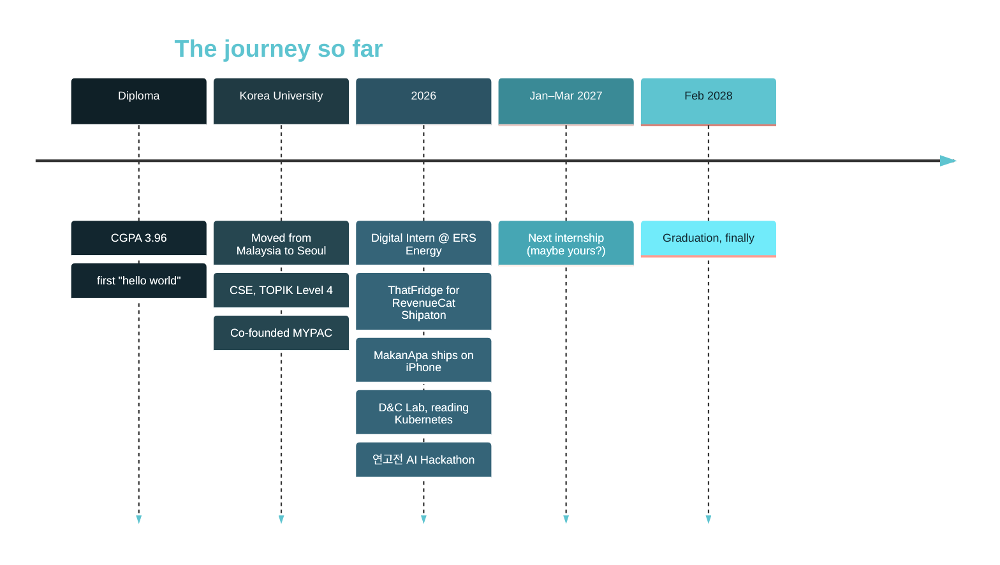

<!-- ============================== HEADER ============================== -->


<div align="center">

<a href="https://github.com/keirara04">
  
</a>

<br/>


<br/>


</div>

<!-- ============================== ABOUT ============================== -->
## Annyeong, I'm Keira 

```ts
const keira = {
  name:      "Muhammad Hakeemi",
  based:     "Seoul, KR  (from Malaysia)",
  studying:  "B.S. Computer Science & Engineering @ Korea University — Feb 2028",
  research:  "Kubernetes source code @ KU Distributed & Cloud Computing Lab",
  building:  ["ThatFridge", "MakanApa", "Roomade", "ShelterLab"],
  speaks:    ["Malay", "English", "Korean (TOPIK 4)"],
  writes:    ["TypeScript", "Kotlin", "Python", "SQL", "C/C++", "Java"],
  ethos:     "ship it, check the logs, write down why it broke",
  fuel:      ["iced americano", "nasi lemak (when I can find it)"],
};
```

I build full-stack web, mobile apps and automations, and I weirdly enjoy the part where everything is on fire. Give me a bug that only happens in production on Tuesdays and I'm happy. Currently splitting my week between Kubernetes source code, a fridge run by four AI agents (ThatFridge), an app that decides where to makan (MakanApa), Roomade, and pretending I'll sleep early tonight.

<!-- ============================== STACK ============================== -->
## Tech stack

<p align="center">
  
  
  
  
  
  
  
  
  
  
  
</p>

<div align="center">

<sub><b>FRONTEND</b></sub>&nbsp; &nbsp;&nbsp;&nbsp; <sub><b>BACKEND</b></sub>&nbsp;
<br/><br/>
<sub><b>MOBILE</b></sub>&nbsp; &nbsp;&nbsp;&nbsp; <sub><b>DATA</b></sub>&nbsp; &nbsp;&nbsp;&nbsp; <sub><b>SYSTEMS</b></sub>&nbsp;
<br/><br/>
<sub><b>INFRA</b></sub>&nbsp;
<br/><br/>

</div>

<!-- ============================== PROJECTS ============================== -->
## Things I've shipped (and am still shipping)

<table>
  <tr>
    <td width="50%" valign="top">
      <h3><a href="https://github.com/naufalkmd/that-fridge">ThatFridge</a></h3>
      <p>   </p>
      <p><i>Your fridge, run by four tiny pixel-art AI agents</i></p>
      <p>Shared household food app built for <b>RevenueCat Shipaton 2026</b>. Know what's in the fridge, use it before it goes off, plan meals with your flatmates.</p>
      <ul>
        <li>Scan a receipt or a fridge photo: rule-based classifiers sort most items with zero AI cost</li>
        <li>The crew: <b>Guardian</b> (expiry), <b>Chef</b> (meals), <b>Organizer</b> (storage), <b>Shopkeeper</b> (low stock)</li>
        <li>Quick Chat with 35 tools that read and edit your real inventory</li>
        <li>Kitchen Lab: AI writes a routine once, then it runs on schedule with no more AI calls</li>
        <li>Freemium on RevenueCat with a row-locked credit ledger (no double grants, no trial farming)</li>
      </ul>
      <p>
        
        
        
        
        
        
      </p>
      <p>
        <a href="https://apps.apple.com/app/thatfridge/id6806239306"></a>
        <a href="https://thatfridge.com"></a>
        <a href="https://github.com/naufalkmd/that-fridge"></a>
      </p>
    </td>
    <td width="50%" valign="top">
      <h3><a href="https://github.com/keirara04/MakanApa">MakanApa</a></h3>
      <p></p>
      <p><i>"Makan apa hari ni?" solved in seconds</i></p>
      <p>Tell it your mood, budget and how far you'll walk. It picks <b>one</b> place nearby, so the group chat can stop arguing.</p>
      <ul>
        <li>Mood-based picks: nasi kandar, ayam gepuk, char kuey teow, or "anything lah"</li>
        <li>Honest halal info: certified, community notes, or not verified yet. Never guessed</li>
        <li>Community-added makan spots and a live stats strip on the site</li>
        <li>Guest mode, preferred maps launcher, push notifications</li>
        <li>Bilingual Malay / English marketing site</li>
      </ul>
      <p>
        
        
        
        
      </p>
      <p></p>
    </td>
  </tr>
  <tr>
    <td width="50%" valign="top">
      <h3>Roomade</h3>
      <p><i>So my flatmates finally do their chores</i></p>
      <p>Native Android & iOS app for shared flats: chores, money and day-to-day logistics in one place.</p>
      <ul>
        <li>Chore rotation and shared shopping lists</li>
        <li>Expense splitting with a settle-up flow</li>
        <li>Chat with mentions, GIFs and Telegram-style read receipts</li>
        <li>Supabase Auth, Postgres + RLS, Storage, Realtime, Edge Functions</li>
      </ul>
      <p>
        
        
        
        
      </p>
      <p></p>
    </td>
    <td width="50%" valign="top">
      <h3><a href="https://github.com/keirara04/ShelterLab">ShelterLab</a></h3>
      <p><i>Campus marketplace with a trust score</i></p>
      <p>Peer-to-peer marketplace for Korean university students across 10+ campuses with campus-only feeds.</p>
      <ul>
        <li><b>LabCred</b>: transparent, tiered credibility score</li>
        <li>AI pricing suggestions via Groq</li>
        <li>Admin dashboard with moderation and live stats</li>
        <li>Upstash rate limiting, JWT, Postgres RLS, PIPA-minded</li>
        <li>PWA: offline, installable, push notifications</li>
      </ul>
      <p>
        
        
        
        
      </p>
      <p>
        <a href="https://shelterlab.shop"></a>
        
      </p>
    </td>
  </tr>
  <tr>
    <td colspan="2" valign="top">
      <h3>Aurora · 2026 연고전 AI Hackathon</h3>
      <p><i>A Python bot that plays capture-the-flag against Yonsei, 300 ms at a time</i></p>
      <p>Team lead of <b>파전</b> (Korea University side). We built an agent for <b>깃발 대항전</b>, a two-player simultaneous-turn strategy game on a 15×15 map with 160 turns: spawn flags, warriors and scouts, fight for 17 buildings, and manage an economy, all inside a 300 ms per-turn budget.</p>
      <ul>
        <li>I owned the core bot: economy (targeting, spawn mix, capture reserve, priority) and combat (escorts, fight checks, defense)</li>
        <li>Local simulator and batch runner against custom opponents: rushers, turtles, warrior spammers</li>
        <li>One change per version, every test logged, safety-audited under 200 ms before each submission</li>
        <li>Final agent: <b>Aurora-2.12DH</b></li>
      </ul>
      <p>
        
        
        
        
      </p>
    </td>
  </tr>
</table>

<!-- ============================== EXPERIENCE ============================== -->
## Experience

**Undergraduate Research Intern** · Distributed & Cloud Computing Lab, Korea University
<sub>Fall 2026 – Dec 2026</sub>
Reading and researching the Kubernetes source code: scheduling, cluster internals, and how cloud workloads are actually orchestrated.

**Digital Intern** · ERS Energy Sdn Bhd, Kuala Lumpur
<sub>Jun 2026 – Sep 2026</sub>
High-ownership Digital team, two production systems.

<details>
<summary><b>Workflow automation</b> — n8n + Google Sheets / Apps Script</summary>
<br/>

Built and debugged a multi-branch, webhook-driven pipeline routing web form submissions into structured storage and downstream CRM sync. Fixed a set of production data-integrity issues:

- A duplicate Apps Script function definition silently overriding the intended logic at runtime
- A case-sensitivity bug that had quietly disabled a consent filter since launch
- Race conditions from concurrent trigger firings, resolved with proper locking
- Fragile state tracking replaced with a scoped, time-windowed deduplication model

</details>

<details>
<summary><b>HRMS rebuild</b> — Next.js + TypeScript + Laravel</summary>
<br/>

Rebuilt a legacy spreadsheet-based time-tracking system as a mobile-first production web app, frontend and backend:

- GPS location capture and photo proof-of-visit
- Role-based navigation for field staff vs. managers / HR
- Travel, training and overtime request & review modules
- CI pipelines for a multi-branch git workflow

</details>

<!-- ============================== TIMELINE ============================== -->
## The journey so far



<!-- ============================== NOW ============================== -->
## Right now

| Building | Learning | Beyond code |
| :-- | :-- | :-- |
| ThatFridge & MakanApa | Distributed systems & caching at scale | Co-founder, MYPAC |
| Roomade & ShelterLab | Kubernetes internals | SNS Manager, KU FSU |
| | Laravel patterns (Sanctum, schema design) | |
| | LLM prompting for structured / agentic tasks | |

<!-- ============================== RECENT ============================== -->
## Lately on GitHub

<!--RECENT_ACTIVITY:start-->
1. 🔨 Pushed 1 commit to [keirara04/MakanApa](https://github.com/keirara04/MakanApa)  <sub>2026-10-09</sub>
2. 🔨 Pushed 1 commit to [naufalkmd/that-fridge](https://github.com/naufalkmd/that-fridge)  <sub>2026-10-09</sub>
3. ⭐ Starred [Appllama/appllama-skills](https://github.com/Appllama/appllama-skills)  <sub>2026-10-09</sub>
4. 🔀 Opened PR [#52](https://github.com/naufalkmd/that-fridge/pull/52) in [naufalkmd/that-fridge](https://github.com/naufalkmd/that-fridge)  <sub>2026-10-09</sub>
5. 🔀 Opened PR [#51](https://github.com/naufalkmd/that-fridge/pull/51) in [naufalkmd/that-fridge](https://github.com/naufalkmd/that-fridge)  <sub>2026-10-09</sub>
6. ⭐ Starred [multica-ai/andrej-karpathy-skills](https://github.com/multica-ai/andrej-karpathy-skills)  <sub>2026-10-02</sub>
<!--RECENT_ACTIVITY:end-->

<!-- ============================== STATS ============================== -->
## GitHub activity

<div align="center">

<picture>
  <source media="(prefers-color-scheme: dark)" srcset="https://github-readme-stats-eta-bay-86.vercel.app/api?username=keirara04&show_icons=true&count_private=true&include_all_commits=true&rank_icon=github&hide_border=true&bg_color=0D1117&title_color=5EC4D0&icon_color=5EC4D0&text_color=C9D1D9&ring_color=5EC4D0"/>
  
</picture>
<picture>
  <source media="(prefers-color-scheme: dark)" srcset="https://github-readme-stats-eta-bay-86.vercel.app/api/top-langs/?username=keirara04&layout=compact&langs_count=8&hide_border=true&bg_color=0D1117&title_color=5EC4D0&text_color=C9D1D9"/>
  
</picture>

<picture>
  <source media="(prefers-color-scheme: dark)" srcset="https://streak-stats.demolab.com/?user=keirara04&hide_border=true&background=0D1117&ring=5EC4D0&fire=5EC4D0&currStreakNum=FFFFFF&currStreakLabel=5EC4D0&sideNums=C9D1D9&sideLabels=C9D1D9&dates=8B949E&stroke=30363D"/>
  
</picture>

<picture>
  <source media="(prefers-color-scheme: dark)" srcset="https://raw.githubusercontent.com/keirara04/keirara04/main/profile-3d-contrib/profile-night-rainbow.svg"/>
  
</picture>

<picture>
  <source media="(prefers-color-scheme: dark)" srcset="https://raw.githubusercontent.com/keirara04/keirara04/output/github-contribution-grid-snake-dark.svg"/>
  
</picture>

<picture>
  <source media="(prefers-color-scheme: dark)" srcset="https://raw.githubusercontent.com/keirara04/keirara04/pacman-output/pacman-contribution-graph-dark.svg"/>
  
</picture>

</div>

<!-- ============================== JOKE ============================== -->
## Mandatory dev joke

<div align="center">
  
  <br/><sub>refresh for a new one, no refunds</sub>
</div>

<!-- ============================== 3D ============================== -->
## Spin me around

<details>
<summary><b>Open the 3D model</b> (drag to rotate, scroll to zoom)</summary>
<br/>

```stl
solid keira
facet normal 0 0 1
outer loop
vertex 4 0 2
vertex 5 0 2
vertex 5 1 2
endloop
endfacet
facet normal 0 0 1
outer loop
vertex 4 0 2
vertex 5 1 2
vertex 4 1 2
endloop
endfacet
facet normal 0 0 -1
outer loop
vertex 4 0 0
vertex 4 1 0
vertex 5 1 0
endloop
endfacet
facet normal 0 0 -1
outer loop
vertex 4 0 0
vertex 5 1 0
vertex 5 0 0
endloop
endfacet
facet normal 1 0 0
outer loop
vertex 5 0 0
vertex 5 1 0
vertex 5 1 2
endloop
endfacet
facet normal 1 0 0
outer loop
vertex 5 0 0
vertex 5 1 2
vertex 5 0 2
endloop
endfacet
facet normal -1 0 0
outer loop
vertex 4 0 0
vertex 4 0 2
vertex 4 1 2
endloop
endfacet
facet normal -1 0 0
outer loop
vertex 4 0 0
vertex 4 1 2
vertex 4 1 0
endloop
endfacet
facet normal 0 1 0
outer loop
vertex 4 1 0
vertex 4 1 2
vertex 5 1 2
endloop
endfacet
facet normal 0 1 0
outer loop
vertex 4 1 0
vertex 5 1 2
vertex 5 1 0
endloop
endfacet
facet normal 0 -1 0
outer loop
vertex 4 0 0
vertex 5 0 0
vertex 5 0 2
endloop
endfacet
facet normal 0 -1 0
outer loop
vertex 4 0 0
vertex 5 0 2
vertex 4 0 2
endloop
endfacet
facet normal 0 0 1
outer loop
vertex 28 3 2
vertex 29 3 2
vertex 29 4 2
endloop
endfacet
facet normal 0 0 1
outer loop
vertex 28 3 2
vertex 29 4 2
vertex 28 4 2
endloop
endfacet
facet normal 0 0 -1
outer loop
vertex 28 3 0
vertex 28 4 0
vertex 29 4 0
endloop
endfacet
facet normal 0 0 -1
outer loop
vertex 28 3 0
vertex 29 4 0
vertex 29 3 0
endloop
endfacet
facet normal 1 0 0
outer loop
vertex 29 3 0
vertex 29 4 0
vertex 29 4 2
endloop
endfacet
facet normal 1 0 0
outer loop
vertex 29 3 0
vertex 29 4 2
vertex 29 3 2
endloop
endfacet
facet normal 0 0 1
outer loop
vertex 8 0 2
vertex 9 0 2
vertex 9 1 2
endloop
endfacet
facet normal 0 0 1
outer loop
vertex 8 0 2
vertex 9 1 2
vertex 8 1 2
endloop
endfacet
facet normal 0 0 -1
outer loop
vertex 8 0 0
vertex 8 1 0
vertex 9 1 0
endloop
endfacet
facet normal 0 0 -1
outer loop
vertex 8 0 0
vertex 9 1 0
vertex 9 0 0
endloop
endfacet
facet normal 0 1 0
outer loop
vertex 8 1 0
vertex 8 1 2
vertex 9 1 2
endloop
endfacet
facet normal 0 1 0
outer loop
vertex 8 1 0
vertex 9 1 2
vertex 9 1 0
endloop
endfacet
facet normal 0 -1 0
outer loop
vertex 8 0 0
vertex 9 0 0
vertex 9 0 2
endloop
endfacet
facet normal 0 -1 0
outer loop
vertex 8 0 0
vertex 9 0 2
vertex 8 0 2
endloop
endfacet
facet normal 0 0 1
outer loop
vertex 10 6 2
vertex 11 6 2
vertex 11 7 2
endloop
endfacet
facet normal 0 0 1
outer loop
vertex 10 6 2
vertex 11 7 2
vertex 10 7 2
endloop
endfacet
facet normal 0 0 -1
outer loop
vertex 10 6 0
vertex 10 7 0
vertex 11 7 0
endloop
endfacet
facet normal 0 0 -1
outer loop
vertex 10 6 0
vertex 11 7 0
vertex 11 6 0
endloop
endfacet
facet normal 1 0 0
outer loop
vertex 11 6 0
vertex 11 7 0
vertex 11 7 2
endloop
endfacet
facet normal 1 0 0
outer loop
vertex 11 6 0
vertex 11 7 2
vertex 11 6 2
endloop
endfacet
facet normal 0 1 0
outer loop
vertex 10 7 0
vertex 10 7 2
vertex 11 7 2
endloop
endfacet
facet normal 0 1 0
outer loop
vertex 10 7 0
vertex 11 7 2
vertex 11 7 0
endloop
endfacet
facet normal 0 -1 0
outer loop
vertex 10 6 0
vertex 11 6 0
vertex 11 6 2
endloop
endfacet
facet normal 0 -1 0
outer loop
vertex 10 6 0
vertex 11 6 2
vertex 10 6 2
endloop
endfacet
facet normal 0 0 1
outer loop
vertex 0 5 2
vertex 1 5 2
vertex 1 6 2
endloop
endfacet
facet normal 0 0 1
outer loop
vertex 0 5 2
vertex 1 6 2
vertex 0 6 2
endloop
endfacet
facet normal 0 0 -1
outer loop
vertex 0 5 0
vertex 0 6 0
vertex 1 6 0
endloop
endfacet
facet normal 0 0 -1
outer loop
vertex 0 5 0
vertex 1 6 0
vertex 1 5 0
endloop
endfacet
facet normal 1 0 0
outer loop
vertex 1 5 0
vertex 1 6 0
vertex 1 6 2
endloop
endfacet
facet normal 1 0 0
outer loop
vertex 1 5 0
vertex 1 6 2
vertex 1 5 2
endloop
endfacet
facet normal -1 0 0
outer loop
vertex 0 5 0
vertex 0 5 2
vertex 0 6 2
endloop
endfacet
facet normal -1 0 0
outer loop
vertex 0 5 0
vertex 0 6 2
vertex 0 6 0
endloop
endfacet
facet normal 0 0 1
outer loop
vertex 2 2 2
vertex 3 2 2
vertex 3 3 2
endloop
endfacet
facet normal 0 0 1
outer loop
vertex 2 2 2
vertex 3 3 2
vertex 2 3 2
endloop
endfacet
facet normal 0 0 -1
outer loop
vertex 2 2 0
vertex 2 3 0
vertex 3 3 0
endloop
endfacet
facet normal 0 0 -1
outer loop
vertex 2 2 0
vertex 3 3 0
vertex 3 2 0
endloop
endfacet
facet normal 1 0 0
outer loop
vertex 3 2 0
vertex 3 3 0
vertex 3 3 2
endloop
endfacet
facet normal 1 0 0
outer loop
vertex 3 2 0
vertex 3 3 2
vertex 3 2 2
endloop
endfacet
facet normal -1 0 0
outer loop
vertex 2 2 0
vertex 2 2 2
vertex 2 3 2
endloop
endfacet
facet normal -1 0 0
outer loop
vertex 2 2 0
vertex 2 3 2
vertex 2 3 0
endloop
endfacet
facet normal 0 1 0
outer loop
vertex 2 3 0
vertex 2 3 2
vertex 3 3 2
endloop
endfacet
facet normal 0 1 0
outer loop
vertex 2 3 0
vertex 3 3 2
vertex 3 3 0
endloop
endfacet
facet normal 0 -1 0
outer loop
vertex 2 2 0
vertex 3 2 0
vertex 3 2 2
endloop
endfacet
facet normal 0 -1 0
outer loop
vertex 2 2 0
vertex 3 2 2
vertex 2 2 2
endloop
endfacet
facet normal 0 0 1
outer loop
vertex 6 2 2
vertex 7 2 2
vertex 7 3 2
endloop
endfacet
facet normal 0 0 1
outer loop
vertex 6 2 2
vertex 7 3 2
vertex 6 3 2
endloop
endfacet
facet normal 0 0 -1
outer loop
vertex 6 2 0
vertex 6 3 0
vertex 7 3 0
endloop
endfacet
facet normal 0 0 -1
outer loop
vertex 6 2 0
vertex 7 3 0
vertex 7 2 0
endloop
endfacet
facet normal 1 0 0
outer loop
vertex 7 2 0
vertex 7 3 0
vertex 7 3 2
endloop
endfacet
facet normal 1 0 0
outer loop
vertex 7 2 0
vertex 7 3 2
vertex 7 2 2
endloop
endfacet
facet normal -1 0 0
outer loop
vertex 6 2 0
vertex 6 2 2
vertex 6 3 2
endloop
endfacet
facet normal -1 0 0
outer loop
vertex 6 2 0
vertex 6 3 2
vertex 6 3 0
endloop
endfacet
facet normal 0 0 1
outer loop
vertex 18 1 2
vertex 19 1 2
vertex 19 2 2
endloop
endfacet
facet normal 0 0 1
outer loop
vertex 18 1 2
vertex 19 2 2
vertex 18 2 2
endloop
endfacet
facet normal 0 0 -1
outer loop
vertex 18 1 0
vertex 18 2 0
vertex 19 2 0
endloop
endfacet
facet normal 0 0 -1
outer loop
vertex 18 1 0
vertex 19 2 0
vertex 19 1 0
endloop
endfacet
facet normal 1 0 0
outer loop
vertex 19 1 0
vertex 19 2 0
vertex 19 2 2
endloop
endfacet
facet normal 1 0 0
outer loop
vertex 19 1 0
vertex 19 2 2
vertex 19 1 2
endloop
endfacet
facet normal -1 0 0
outer loop
vertex 18 1 0
vertex 18 1 2
vertex 18 2 2
endloop
endfacet
facet normal -1 0 0
outer loop
vertex 18 1 0
vertex 18 2 2
vertex 18 2 0
endloop
endfacet
facet normal 0 0 1
outer loop
vertex 27 6 2
vertex 28 6 2
vertex 28 7 2
endloop
endfacet
facet normal 0 0 1
outer loop
vertex 27 6 2
vertex 28 7 2
vertex 27 7 2
endloop
endfacet
facet normal 0 0 -1
outer loop
vertex 27 6 0
vertex 27 7 0
vertex 28 7 0
endloop
endfacet
facet normal 0 0 -1
outer loop
vertex 27 6 0
vertex 28 7 0
vertex 28 6 0
endloop
endfacet
facet normal 1 0 0
outer loop
vertex 28 6 0
vertex 28 7 0
vertex 28 7 2
endloop
endfacet
facet normal 1 0 0
outer loop
vertex 28 6 0
vertex 28 7 2
vertex 28 6 2
endloop
endfacet
facet normal 0 1 0
outer loop
vertex 27 7 0
vertex 27 7 2
vertex 28 7 2
endloop
endfacet
facet normal 0 1 0
outer loop
vertex 27 7 0
vertex 28 7 2
vertex 28 7 0
endloop
endfacet
facet normal 0 -1 0
outer loop
vertex 27 6 0
vertex 28 6 0
vertex 28 6 2
endloop
endfacet
facet normal 0 -1 0
outer loop
vertex 27 6 0
vertex 28 6 2
vertex 27 6 2
endloop
endfacet
facet normal 0 0 1
outer loop
vertex 28 5 2
vertex 29 5 2
vertex 29 6 2
endloop
endfacet
facet normal 0 0 1
outer loop
vertex 28 5 2
vertex 29 6 2
vertex 28 6 2
endloop
endfacet
facet normal 0 0 -1
outer loop
vertex 28 5 0
vertex 28 6 0
vertex 29 6 0
endloop
endfacet
facet normal 0 0 -1
outer loop
vertex 28 5 0
vertex 29 6 0
vertex 29 5 0
endloop
endfacet
facet normal 1 0 0
outer loop
vertex 29 5 0
vertex 29 6 0
vertex 29 6 2
endloop
endfacet
facet normal 1 0 0
outer loop
vertex 29 5 0
vertex 29 6 2
vertex 29 5 2
endloop
endfacet
facet normal -1 0 0
outer loop
vertex 28 5 0
vertex 28 5 2
vertex 28 6 2
endloop
endfacet
facet normal -1 0 0
outer loop
vertex 28 5 0
vertex 28 6 2
vertex 28 6 0
endloop
endfacet
facet normal 0 1 0
outer loop
vertex 28 6 0
vertex 28 6 2
vertex 29 6 2
endloop
endfacet
facet normal 0 1 0
outer loop
vertex 28 6 0
vertex 29 6 2
vertex 29 6 0
endloop
endfacet
facet normal 0 0 1
outer loop
vertex 2 4 2
vertex 3 4 2
vertex 3 5 2
endloop
endfacet
facet normal 0 0 1
outer loop
vertex 2 4 2
vertex 3 5 2
vertex 2 5 2
endloop
endfacet
facet normal 0 0 -1
outer loop
vertex 2 4 0
vertex 2 5 0
vertex 3 5 0
endloop
endfacet
facet normal 0 0 -1
outer loop
vertex 2 4 0
vertex 3 5 0
vertex 3 4 0
endloop
endfacet
facet normal 1 0 0
outer loop
vertex 3 4 0
vertex 3 5 0
vertex 3 5 2
endloop
endfacet
facet normal 1 0 0
outer loop
vertex 3 4 0
vertex 3 5 2
vertex 3 4 2
endloop
endfacet
facet normal -1 0 0
outer loop
vertex 2 4 0
vertex 2 4 2
vertex 2 5 2
endloop
endfacet
facet normal -1 0 0
outer loop
vertex 2 4 0
vertex 2 5 2
vertex 2 5 0
endloop
endfacet
facet normal 0 1 0
outer loop
vertex 2 5 0
vertex 2 5 2
vertex 3 5 2
endloop
endfacet
facet normal 0 1 0
outer loop
vertex 2 5 0
vertex 3 5 2
vertex 3 5 0
endloop
endfacet
facet normal 0 -1 0
outer loop
vertex 2 4 0
vertex 3 4 0
vertex 3 4 2
endloop
endfacet
facet normal 0 -1 0
outer loop
vertex 2 4 0
vertex 3 4 2
vertex 2 4 2
endloop
endfacet
facet normal 0 0 1
outer loop
vertex 24 1 2
vertex 25 1 2
vertex 25 2 2
endloop
endfacet
facet normal 0 0 1
outer loop
vertex 24 1 2
vertex 25 2 2
vertex 24 2 2
endloop
endfacet
facet normal 0 0 -1
outer loop
vertex 24 1 0
vertex 24 2 0
vertex 25 2 0
endloop
endfacet
facet normal 0 0 -1
outer loop
vertex 24 1 0
vertex 25 2 0
vertex 25 1 0
endloop
endfacet
facet normal 1 0 0
outer loop
vertex 25 1 0
vertex 25 2 0
vertex 25 2 2
endloop
endfacet
facet normal 1 0 0
outer loop
vertex 25 1 0
vertex 25 2 2
vertex 25 1 2
endloop
endfacet
facet normal -1 0 0
outer loop
vertex 24 1 0
vertex 24 1 2
vertex 24 2 2
endloop
endfacet
facet normal -1 0 0
outer loop
vertex 24 1 0
vertex 24 2 2
vertex 24 2 0
endloop
endfacet
facet normal 0 0 1
outer loop
vertex 6 4 2
vertex 7 4 2
vertex 7 5 2
endloop
endfacet
facet normal 0 0 1
outer loop
vertex 6 4 2
vertex 7 5 2
vertex 6 5 2
endloop
endfacet
facet normal 0 0 -1
outer loop
vertex 6 4 0
vertex 6 5 0
vertex 7 5 0
endloop
endfacet
facet normal 0 0 -1
outer loop
vertex 6 4 0
vertex 7 5 0
vertex 7 4 0
endloop
endfacet
facet normal 1 0 0
outer loop
vertex 7 4 0
vertex 7 5 0
vertex 7 5 2
endloop
endfacet
facet normal 1 0 0
outer loop
vertex 7 4 0
vertex 7 5 2
vertex 7 4 2
endloop
endfacet
facet normal -1 0 0
outer loop
vertex 6 4 0
vertex 6 4 2
vertex 6 5 2
endloop
endfacet
facet normal -1 0 0
outer loop
vertex 6 4 0
vertex 6 5 2
vertex 6 5 0
endloop
endfacet
facet normal 0 0 1
outer loop
vertex 16 6 2
vertex 17 6 2
vertex 17 7 2
endloop
endfacet
facet normal 0 0 1
outer loop
vertex 16 6 2
vertex 17 7 2
vertex 16 7 2
endloop
endfacet
facet normal 0 0 -1
outer loop
vertex 16 6 0
vertex 16 7 0
vertex 17 7 0
endloop
endfacet
facet normal 0 0 -1
outer loop
vertex 16 6 0
vertex 17 7 0
vertex 17 6 0
endloop
endfacet
facet normal 1 0 0
outer loop
vertex 17 6 0
vertex 17 7 0
vertex 17 7 2
endloop
endfacet
facet normal 1 0 0
outer loop
vertex 17 6 0
vertex 17 7 2
vertex 17 6 2
endloop
endfacet
facet normal 0 1 0
outer loop
vertex 16 7 0
vertex 16 7 2
vertex 17 7 2
endloop
endfacet
facet normal 0 1 0
outer loop
vertex 16 7 0
vertex 17 7 2
vertex 17 7 0
endloop
endfacet
facet normal 0 -1 0
outer loop
vertex 16 6 0
vertex 17 6 0
vertex 17 6 2
endloop
endfacet
facet normal 0 -1 0
outer loop
vertex 16 6 0
vertex 17 6 2
vertex 16 6 2
endloop
endfacet
facet normal 0 0 1
outer loop
vertex 7 3 2
vertex 8 3 2
vertex 8 4 2
endloop
endfacet
facet normal 0 0 1
outer loop
vertex 7 3 2
vertex 8 4 2
vertex 7 4 2
endloop
endfacet
facet normal 0 0 -1
outer loop
vertex 7 3 0
vertex 7 4 0
vertex 8 4 0
endloop
endfacet
facet normal 0 0 -1
outer loop
vertex 7 3 0
vertex 8 4 0
vertex 8 3 0
endloop
endfacet
facet normal 0 1 0
outer loop
vertex 7 4 0
vertex 7 4 2
vertex 8 4 2
endloop
endfacet
facet normal 0 1 0
outer loop
vertex 7 4 0
vertex 8 4 2
vertex 8 4 0
endloop
endfacet
facet normal 0 -1 0
outer loop
vertex 7 3 0
vertex 8 3 0
vertex 8 3 2
endloop
endfacet
facet normal 0 -1 0
outer loop
vertex 7 3 0
vertex 8 3 2
vertex 7 3 2
endloop
endfacet
facet normal 0 0 1
outer loop
vertex 18 3 2
vertex 19 3 2
vertex 19 4 2
endloop
endfacet
facet normal 0 0 1
outer loop
vertex 18 3 2
vertex 19 4 2
vertex 18 4 2
endloop
endfacet
facet normal 0 0 -1
outer loop
vertex 18 3 0
vertex 18 4 0
vertex 19 4 0
endloop
endfacet
facet normal 0 0 -1
outer loop
vertex 18 3 0
vertex 19 4 0
vertex 19 3 0
endloop
endfacet
facet normal -1 0 0
outer loop
vertex 18 3 0
vertex 18 3 2
vertex 18 4 2
endloop
endfacet
facet normal -1 0 0
outer loop
vertex 18 3 0
vertex 18 4 2
vertex 18 4 0
endloop
endfacet
facet normal 0 0 1
outer loop
vertex 9 3 2
vertex 10 3 2
vertex 10 4 2
endloop
endfacet
facet normal 0 0 1
outer loop
vertex 9 3 2
vertex 10 4 2
vertex 9 4 2
endloop
endfacet
facet normal 0 0 -1
outer loop
vertex 9 3 0
vertex 9 4 0
vertex 10 4 0
endloop
endfacet
facet normal 0 0 -1
outer loop
vertex 9 3 0
vertex 10 4 0
vertex 10 3 0
endloop
endfacet
facet normal 1 0 0
outer loop
vertex 10 3 0
vertex 10 4 0
vertex 10 4 2
endloop
endfacet
facet normal 1 0 0
outer loop
vertex 10 3 0
vertex 10 4 2
vertex 10 3 2
endloop
endfacet
facet normal 0 1 0
outer loop
vertex 9 4 0
vertex 9 4 2
vertex 10 4 2
endloop
endfacet
facet normal 0 1 0
outer loop
vertex 9 4 0
vertex 10 4 2
vertex 10 4 0
endloop
endfacet
facet normal 0 -1 0
outer loop
vertex 9 3 0
vertex 10 3 0
vertex 10 3 2
endloop
endfacet
facet normal 0 -1 0
outer loop
vertex 9 3 0
vertex 10 3 2
vertex 9 3 2
endloop
endfacet
facet normal 0 0 1
outer loop
vertex 0 0 2
vertex 1 0 2
vertex 1 1 2
endloop
endfacet
facet normal 0 0 1
outer loop
vertex 0 0 2
vertex 1 1 2
vertex 0 1 2
endloop
endfacet
facet normal 0 0 -1
outer loop
vertex 0 0 0
vertex 0 1 0
vertex 1 1 0
endloop
endfacet
facet normal 0 0 -1
outer loop
vertex 0 0 0
vertex 1 1 0
vertex 1 0 0
endloop
endfacet
facet normal 1 0 0
outer loop
vertex 1 0 0
vertex 1 1 0
vertex 1 1 2
endloop
endfacet
facet normal 1 0 0
outer loop
vertex 1 0 0
vertex 1 1 2
vertex 1 0 2
endloop
endfacet
facet normal -1 0 0
outer loop
vertex 0 0 0
vertex 0 0 2
vertex 0 1 2
endloop
endfacet
facet normal -1 0 0
outer loop
vertex 0 0 0
vertex 0 1 2
vertex 0 1 0
endloop
endfacet
facet normal 0 -1 0
outer loop
vertex 0 0 0
vertex 1 0 0
vertex 1 0 2
endloop
endfacet
facet normal 0 -1 0
outer loop
vertex 0 0 0
vertex 1 0 2
vertex 0 0 2
endloop
endfacet
facet normal 0 0 1
outer loop
vertex 24 3 2
vertex 25 3 2
vertex 25 4 2
endloop
endfacet
facet normal 0 0 1
outer loop
vertex 24 3 2
vertex 25 4 2
vertex 24 4 2
endloop
endfacet
facet normal 0 0 -1
outer loop
vertex 24 3 0
vertex 24 4 0
vertex 25 4 0
endloop
endfacet
facet normal 0 0 -1
outer loop
vertex 24 3 0
vertex 25 4 0
vertex 25 3 0
endloop
endfacet
facet normal -1 0 0
outer loop
vertex 24 3 0
vertex 24 3 2
vertex 24 4 2
endloop
endfacet
facet normal -1 0 0
outer loop
vertex 24 3 0
vertex 24 4 2
vertex 24 4 0
endloop
endfacet
facet normal 0 0 1
outer loop
vertex 15 0 2
vertex 16 0 2
vertex 16 1 2
endloop
endfacet
facet normal 0 0 1
outer loop
vertex 15 0 2
vertex 16 1 2
vertex 15 1 2
endloop
endfacet
facet normal 0 0 -1
outer loop
vertex 15 0 0
vertex 15 1 0
vertex 16 1 0
endloop
endfacet
facet normal 0 0 -1
outer loop
vertex 15 0 0
vertex 16 1 0
vertex 16 0 0
endloop
endfacet
facet normal 0 1 0
outer loop
vertex 15 1 0
vertex 15 1 2
vertex 16 1 2
endloop
endfacet
facet normal 0 1 0
outer loop
vertex 15 1 0
vertex 16 1 2
vertex 16 1 0
endloop
endfacet
facet normal 0 -1 0
outer loop
vertex 15 0 0
vertex 16 0 0
vertex 16 0 2
endloop
endfacet
facet normal 0 -1 0
outer loop
vertex 15 0 0
vertex 16 0 2
vertex 15 0 2
endloop
endfacet
facet normal 0 0 1
outer loop
vertex 6 6 2
vertex 7 6 2
vertex 7 7 2
endloop
endfacet
facet normal 0 0 1
outer loop
vertex 6 6 2
vertex 7 7 2
vertex 6 7 2
endloop
endfacet
facet normal 0 0 -1
outer loop
vertex 6 6 0
vertex 6 7 0
vertex 7 7 0
endloop
endfacet
facet normal 0 0 -1
outer loop
vertex 6 6 0
vertex 7 7 0
vertex 7 6 0
endloop
endfacet
facet normal -1 0 0
outer loop
vertex 6 6 0
vertex 6 6 2
vertex 6 7 2
endloop
endfacet
facet normal -1 0 0
outer loop
vertex 6 6 0
vertex 6 7 2
vertex 6 7 0
endloop
endfacet
facet normal 0 1 0
outer loop
vertex 6 7 0
vertex 6 7 2
vertex 7 7 2
endloop
endfacet
facet normal 0 1 0
outer loop
vertex 6 7 0
vertex 7 7 2
vertex 7 7 0
endloop
endfacet
facet normal 0 0 1
outer loop
vertex 18 5 2
vertex 19 5 2
vertex 19 6 2
endloop
endfacet
facet normal 0 0 1
outer loop
vertex 18 5 2
vertex 19 6 2
vertex 18 6 2
endloop
endfacet
facet normal 0 0 -1
outer loop
vertex 18 5 0
vertex 18 6 0
vertex 19 6 0
endloop
endfacet
facet normal 0 0 -1
outer loop
vertex 18 5 0
vertex 19 6 0
vertex 19 5 0
endloop
endfacet
facet normal 1 0 0
outer loop
vertex 19 5 0
vertex 19 6 0
vertex 19 6 2
endloop
endfacet
facet normal 1 0 0
outer loop
vertex 19 5 0
vertex 19 6 2
vertex 19 5 2
endloop
endfacet
facet normal -1 0 0
outer loop
vertex 18 5 0
vertex 18 5 2
vertex 18 6 2
endloop
endfacet
facet normal -1 0 0
outer loop
vertex 18 5 0
vertex 18 6 2
vertex 18 6 0
endloop
endfacet
facet normal 0 0 1
outer loop
vertex 22 5 2
vertex 23 5 2
vertex 23 6 2
endloop
endfacet
facet normal 0 0 1
outer loop
vertex 22 5 2
vertex 23 6 2
vertex 22 6 2
endloop
endfacet
facet normal 0 0 -1
outer loop
vertex 22 5 0
vertex 22 6 0
vertex 23 6 0
endloop
endfacet
facet normal 0 0 -1
outer loop
vertex 22 5 0
vertex 23 6 0
vertex 23 5 0
endloop
endfacet
facet normal 1 0 0
outer loop
vertex 23 5 0
vertex 23 6 0
vertex 23 6 2
endloop
endfacet
facet normal 1 0 0
outer loop
vertex 23 5 0
vertex 23 6 2
vertex 23 5 2
endloop
endfacet
facet normal -1 0 0
outer loop
vertex 22 5 0
vertex 22 5 2
vertex 22 6 2
endloop
endfacet
facet normal -1 0 0
outer loop
vertex 22 5 0
vertex 22 6 2
vertex 22 6 0
endloop
endfacet
facet normal 0 1 0
outer loop
vertex 22 6 0
vertex 22 6 2
vertex 23 6 2
endloop
endfacet
facet normal 0 1 0
outer loop
vertex 22 6 0
vertex 23 6 2
vertex 23 6 0
endloop
endfacet
facet normal 0 0 1
outer loop
vertex 3 1 2
vertex 4 1 2
vertex 4 2 2
endloop
endfacet
facet normal 0 0 1
outer loop
vertex 3 1 2
vertex 4 2 2
vertex 3 2 2
endloop
endfacet
facet normal 0 0 -1
outer loop
vertex 3 1 0
vertex 3 2 0
vertex 4 2 0
endloop
endfacet
facet normal 0 0 -1
outer loop
vertex 3 1 0
vertex 4 2 0
vertex 4 1 0
endloop
endfacet
facet normal 1 0 0
outer loop
vertex 4 1 0
vertex 4 2 0
vertex 4 2 2
endloop
endfacet
facet normal 1 0 0
outer loop
vertex 4 1 0
vertex 4 2 2
vertex 4 1 2
endloop
endfacet
facet normal -1 0 0
outer loop
vertex 3 1 0
vertex 3 1 2
vertex 3 2 2
endloop
endfacet
facet normal -1 0 0
outer loop
vertex 3 1 0
vertex 3 2 2
vertex 3 2 0
endloop
endfacet
facet normal 0 1 0
outer loop
vertex 3 2 0
vertex 3 2 2
vertex 4 2 2
endloop
endfacet
facet normal 0 1 0
outer loop
vertex 3 2 0
vertex 4 2 2
vertex 4 2 0
endloop
endfacet
facet normal 0 -1 0
outer loop
vertex 3 1 0
vertex 4 1 0
vertex 4 1 2
endloop
endfacet
facet normal 0 -1 0
outer loop
vertex 3 1 0
vertex 4 1 2
vertex 3 1 2
endloop
endfacet
facet normal 0 0 1
outer loop
vertex 14 1 2
vertex 15 1 2
vertex 15 2 2
endloop
endfacet
facet normal 0 0 1
outer loop
vertex 14 1 2
vertex 15 2 2
vertex 14 2 2
endloop
endfacet
facet normal 0 0 -1
outer loop
vertex 14 1 0
vertex 14 2 0
vertex 15 2 0
endloop
endfacet
facet normal 0 0 -1
outer loop
vertex 14 1 0
vertex 15 2 0
vertex 15 1 0
endloop
endfacet
facet normal 1 0 0
outer loop
vertex 15 1 0
vertex 15 2 0
vertex 15 2 2
endloop
endfacet
facet normal 1 0 0
outer loop
vertex 15 1 0
vertex 15 2 2
vertex 15 1 2
endloop
endfacet
facet normal -1 0 0
outer loop
vertex 14 1 0
vertex 14 1 2
vertex 14 2 2
endloop
endfacet
facet normal -1 0 0
outer loop
vertex 14 1 0
vertex 14 2 2
vertex 14 2 0
endloop
endfacet
facet normal 0 0 1
outer loop
vertex 28 0 2
vertex 29 0 2
vertex 29 1 2
endloop
endfacet
facet normal 0 0 1
outer loop
vertex 28 0 2
vertex 29 1 2
vertex 28 1 2
endloop
endfacet
facet normal 0 0 -1
outer loop
vertex 28 0 0
vertex 28 1 0
vertex 29 1 0
endloop
endfacet
facet normal 0 0 -1
outer loop
vertex 28 0 0
vertex 29 1 0
vertex 29 0 0
endloop
endfacet
facet normal 1 0 0
outer loop
vertex 29 0 0
vertex 29 1 0
vertex 29 1 2
endloop
endfacet
facet normal 1 0 0
outer loop
vertex 29 0 0
vertex 29 1 2
vertex 29 0 2
endloop
endfacet
facet normal -1 0 0
outer loop
vertex 28 0 0
vertex 28 0 2
vertex 28 1 2
endloop
endfacet
facet normal -1 0 0
outer loop
vertex 28 0 0
vertex 28 1 2
vertex 28 1 0
endloop
endfacet
facet normal 0 -1 0
outer loop
vertex 28 0 0
vertex 29 0 0
vertex 29 0 2
endloop
endfacet
facet normal 0 -1 0
outer loop
vertex 28 0 0
vertex 29 0 2
vertex 28 0 2
endloop
endfacet
facet normal 0 0 1
outer loop
vertex 19 6 2
vertex 20 6 2
vertex 20 7 2
endloop
endfacet
facet normal 0 0 1
outer loop
vertex 19 6 2
vertex 20 7 2
vertex 19 7 2
endloop
endfacet
facet normal 0 0 -1
outer loop
vertex 19 6 0
vertex 19 7 0
vertex 20 7 0
endloop
endfacet
facet normal 0 0 -1
outer loop
vertex 19 6 0
vertex 20 7 0
vertex 20 6 0
endloop
endfacet
facet normal 0 1 0
outer loop
vertex 19 7 0
vertex 19 7 2
vertex 20 7 2
endloop
endfacet
facet normal 0 1 0
outer loop
vertex 19 7 0
vertex 20 7 2
vertex 20 7 0
endloop
endfacet
facet normal 0 -1 0
outer loop
vertex 19 6 0
vertex 20 6 0
vertex 20 6 2
endloop
endfacet
facet normal 0 -1 0
outer loop
vertex 19 6 0
vertex 20 6 2
vertex 19 6 2
endloop
endfacet
facet normal 0 0 1
outer loop
vertex 0 2 2
vertex 1 2 2
vertex 1 3 2
endloop
endfacet
facet normal 0 0 1
outer loop
vertex 0 2 2
vertex 1 3 2
vertex 0 3 2
endloop
endfacet
facet normal 0 0 -1
outer loop
vertex 0 2 0
vertex 0 3 0
vertex 1 3 0
endloop
endfacet
facet normal 0 0 -1
outer loop
vertex 0 2 0
vertex 1 3 0
vertex 1 2 0
endloop
endfacet
facet normal 1 0 0
outer loop
vertex 1 2 0
vertex 1 3 0
vertex 1 3 2
endloop
endfacet
facet normal 1 0 0
outer loop
vertex 1 2 0
vertex 1 3 2
vertex 1 2 2
endloop
endfacet
facet normal -1 0 0
outer loop
vertex 0 2 0
vertex 0 2 2
vertex 0 3 2
endloop
endfacet
facet normal -1 0 0
outer loop
vertex 0 2 0
vertex 0 3 2
vertex 0 3 0
endloop
endfacet
facet normal 0 0 1
outer loop
vertex 1 3 2
vertex 2 3 2
vertex 2 4 2
endloop
endfacet
facet normal 0 0 1
outer loop
vertex 1 3 2
vertex 2 4 2
vertex 1 4 2
endloop
endfacet
facet normal 0 0 -1
outer loop
vertex 1 3 0
vertex 1 4 0
vertex 2 4 0
endloop
endfacet
facet normal 0 0 -1
outer loop
vertex 1 3 0
vertex 2 4 0
vertex 2 3 0
endloop
endfacet
facet normal 1 0 0
outer loop
vertex 2 3 0
vertex 2 4 0
vertex 2 4 2
endloop
endfacet
facet normal 1 0 0
outer loop
vertex 2 3 0
vertex 2 4 2
vertex 2 3 2
endloop
endfacet
facet normal 0 1 0
outer loop
vertex 1 4 0
vertex 1 4 2
vertex 2 4 2
endloop
endfacet
facet normal 0 1 0
outer loop
vertex 1 4 0
vertex 2 4 2
vertex 2 4 0
endloop
endfacet
facet normal 0 -1 0
outer loop
vertex 1 3 0
vertex 2 3 0
vertex 2 3 2
endloop
endfacet
facet normal 0 -1 0
outer loop
vertex 1 3 0
vertex 2 3 2
vertex 1 3 2
endloop
endfacet
facet normal 0 0 1
outer loop
vertex 24 5 2
vertex 25 5 2
vertex 25 6 2
endloop
endfacet
facet normal 0 0 1
outer loop
vertex 24 5 2
vertex 25 6 2
vertex 24 6 2
endloop
endfacet
facet normal 0 0 -1
outer loop
vertex 24 5 0
vertex 24 6 0
vertex 25 6 0
endloop
endfacet
facet normal 0 0 -1
outer loop
vertex 24 5 0
vertex 25 6 0
vertex 25 5 0
endloop
endfacet
facet normal 1 0 0
outer loop
vertex 25 5 0
vertex 25 6 0
vertex 25 6 2
endloop
endfacet
facet normal 1 0 0
outer loop
vertex 25 5 0
vertex 25 6 2
vertex 25 5 2
endloop
endfacet
facet normal -1 0 0
outer loop
vertex 24 5 0
vertex 24 5 2
vertex 24 6 2
endloop
endfacet
facet normal -1 0 0
outer loop
vertex 24 5 0
vertex 24 6 2
vertex 24 6 0
endloop
endfacet
facet normal 0 1 0
outer loop
vertex 24 6 0
vertex 24 6 2
vertex 25 6 2
endloop
endfacet
facet normal 0 1 0
outer loop
vertex 24 6 0
vertex 25 6 2
vertex 25 6 0
endloop
endfacet
facet normal 0 0 1
outer loop
vertex 12 6 2
vertex 13 6 2
vertex 13 7 2
endloop
endfacet
facet normal 0 0 1
outer loop
vertex 12 6 2
vertex 13 7 2
vertex 12 7 2
endloop
endfacet
facet normal 0 0 -1
outer loop
vertex 12 6 0
vertex 12 7 0
vertex 13 7 0
endloop
endfacet
facet normal 0 0 -1
outer loop
vertex 12 6 0
vertex 13 7 0
vertex 13 6 0
endloop
endfacet
facet normal -1 0 0
outer loop
vertex 12 6 0
vertex 12 6 2
vertex 12 7 2
endloop
endfacet
facet normal -1 0 0
outer loop
vertex 12 6 0
vertex 12 7 2
vertex 12 7 0
endloop
endfacet
facet normal 0 1 0
outer loop
vertex 12 7 0
vertex 12 7 2
vertex 13 7 2
endloop
endfacet
facet normal 0 1 0
outer loop
vertex 12 7 0
vertex 13 7 2
vertex 13 7 0
endloop
endfacet
facet normal 0 -1 0
outer loop
vertex 12 6 0
vertex 13 6 0
vertex 13 6 2
endloop
endfacet
facet normal 0 -1 0
outer loop
vertex 12 6 0
vertex 13 6 2
vertex 12 6 2
endloop
endfacet
facet normal 0 0 1
outer loop
vertex 14 3 2
vertex 15 3 2
vertex 15 4 2
endloop
endfacet
facet normal 0 0 1
outer loop
vertex 14 3 2
vertex 15 4 2
vertex 14 4 2
endloop
endfacet
facet normal 0 0 -1
outer loop
vertex 14 3 0
vertex 14 4 0
vertex 15 4 0
endloop
endfacet
facet normal 0 0 -1
outer loop
vertex 14 3 0
vertex 15 4 0
vertex 15 3 0
endloop
endfacet
facet normal 1 0 0
outer loop
vertex 15 3 0
vertex 15 4 0
vertex 15 4 2
endloop
endfacet
facet normal 1 0 0
outer loop
vertex 15 3 0
vertex 15 4 2
vertex 15 3 2
endloop
endfacet
facet normal -1 0 0
outer loop
vertex 14 3 0
vertex 14 3 2
vertex 14 4 2
endloop
endfacet
facet normal -1 0 0
outer loop
vertex 14 3 0
vertex 14 4 2
vertex 14 4 0
endloop
endfacet
facet normal 0 0 1
outer loop
vertex 28 2 2
vertex 29 2 2
vertex 29 3 2
endloop
endfacet
facet normal 0 0 1
outer loop
vertex 28 2 2
vertex 29 3 2
vertex 28 3 2
endloop
endfacet
facet normal 0 0 -1
outer loop
vertex 28 2 0
vertex 28 3 0
vertex 29 3 0
endloop
endfacet
facet normal 0 0 -1
outer loop
vertex 28 2 0
vertex 29 3 0
vertex 29 2 0
endloop
endfacet
facet normal 1 0 0
outer loop
vertex 29 2 0
vertex 29 3 0
vertex 29 3 2
endloop
endfacet
facet normal 1 0 0
outer loop
vertex 29 2 0
vertex 29 3 2
vertex 29 2 2
endloop
endfacet
facet normal -1 0 0
outer loop
vertex 28 2 0
vertex 28 2 2
vertex 28 3 2
endloop
endfacet
facet normal -1 0 0
outer loop
vertex 28 2 0
vertex 28 3 2
vertex 28 3 0
endloop
endfacet
facet normal 0 0 1
outer loop
vertex 6 1 2
vertex 7 1 2
vertex 7 2 2
endloop
endfacet
facet normal 0 0 1
outer loop
vertex 6 1 2
vertex 7 2 2
vertex 6 2 2
endloop
endfacet
facet normal 0 0 -1
outer loop
vertex 6 1 0
vertex 6 2 0
vertex 7 2 0
endloop
endfacet
facet normal 0 0 -1
outer loop
vertex 6 1 0
vertex 7 2 0
vertex 7 1 0
endloop
endfacet
facet normal 1 0 0
outer loop
vertex 7 1 0
vertex 7 2 0
vertex 7 2 2
endloop
endfacet
facet normal 1 0 0
outer loop
vertex 7 1 0
vertex 7 2 2
vertex 7 1 2
endloop
endfacet
facet normal -1 0 0
outer loop
vertex 6 1 0
vertex 6 1 2
vertex 6 2 2
endloop
endfacet
facet normal -1 0 0
outer loop
vertex 6 1 0
vertex 6 2 2
vertex 6 2 0
endloop
endfacet
facet normal 0 0 1
outer loop
vertex 25 6 2
vertex 26 6 2
vertex 26 7 2
endloop
endfacet
facet normal 0 0 1
outer loop
vertex 25 6 2
vertex 26 7 2
vertex 25 7 2
endloop
endfacet
facet normal 0 0 -1
outer loop
vertex 25 6 0
vertex 25 7 0
vertex 26 7 0
endloop
endfacet
facet normal 0 0 -1
outer loop
vertex 25 6 0
vertex 26 7 0
vertex 26 6 0
endloop
endfacet
facet normal -1 0 0
outer loop
vertex 25 6 0
vertex 25 6 2
vertex 25 7 2
endloop
endfacet
facet normal -1 0 0
outer loop
vertex 25 6 0
vertex 25 7 2
vertex 25 7 0
endloop
endfacet
facet normal 0 1 0
outer loop
vertex 25 7 0
vertex 25 7 2
vertex 26 7 2
endloop
endfacet
facet normal 0 1 0
outer loop
vertex 25 7 0
vertex 26 7 2
vertex 26 7 0
endloop
endfacet
facet normal 0 -1 0
outer loop
vertex 25 6 0
vertex 26 6 0
vertex 26 6 2
endloop
endfacet
facet normal 0 -1 0
outer loop
vertex 25 6 0
vertex 26 6 2
vertex 25 6 2
endloop
endfacet
facet normal 0 0 1
outer loop
vertex 7 0 2
vertex 8 0 2
vertex 8 1 2
endloop
endfacet
facet normal 0 0 1
outer loop
vertex 7 0 2
vertex 8 1 2
vertex 7 1 2
endloop
endfacet
facet normal 0 0 -1
outer loop
vertex 7 0 0
vertex 7 1 0
vertex 8 1 0
endloop
endfacet
facet normal 0 0 -1
outer loop
vertex 7 0 0
vertex 8 1 0
vertex 8 0 0
endloop
endfacet
facet normal 0 1 0
outer loop
vertex 7 1 0
vertex 7 1 2
vertex 8 1 2
endloop
endfacet
facet normal 0 1 0
outer loop
vertex 7 1 0
vertex 8 1 2
vertex 8 1 0
endloop
endfacet
facet normal 0 -1 0
outer loop
vertex 7 0 0
vertex 8 0 0
vertex 8 0 2
endloop
endfacet
facet normal 0 -1 0
outer loop
vertex 7 0 0
vertex 8 0 2
vertex 7 0 2
endloop
endfacet
facet normal 0 0 1
outer loop
vertex 18 0 2
vertex 19 0 2
vertex 19 1 2
endloop
endfacet
facet normal 0 0 1
outer loop
vertex 18 0 2
vertex 19 1 2
vertex 18 1 2
endloop
endfacet
facet normal 0 0 -1
outer loop
vertex 18 0 0
vertex 18 1 0
vertex 19 1 0
endloop
endfacet
facet normal 0 0 -1
outer loop
vertex 18 0 0
vertex 19 1 0
vertex 19 0 0
endloop
endfacet
facet normal 1 0 0
outer loop
vertex 19 0 0
vertex 19 1 0
vertex 19 1 2
endloop
endfacet
facet normal 1 0 0
outer loop
vertex 19 0 0
vertex 19 1 2
vertex 19 0 2
endloop
endfacet
facet normal -1 0 0
outer loop
vertex 18 0 0
vertex 18 0 2
vertex 18 1 2
endloop
endfacet
facet normal -1 0 0
outer loop
vertex 18 0 0
vertex 18 1 2
vertex 18 1 0
endloop
endfacet
facet normal 0 -1 0
outer loop
vertex 18 0 0
vertex 19 0 0
vertex 19 0 2
endloop
endfacet
facet normal 0 -1 0
outer loop
vertex 18 0 0
vertex 19 0 2
vertex 18 0 2
endloop
endfacet
facet normal 0 0 1
outer loop
vertex 20 3 2
vertex 21 3 2
vertex 21 4 2
endloop
endfacet
facet normal 0 0 1
outer loop
vertex 20 3 2
vertex 21 4 2
vertex 20 4 2
endloop
endfacet
facet normal 0 0 -1
outer loop
vertex 20 3 0
vertex 20 4 0
vertex 21 4 0
endloop
endfacet
facet normal 0 0 -1
outer loop
vertex 20 3 0
vertex 21 4 0
vertex 21 3 0
endloop
endfacet
facet normal 0 1 0
outer loop
vertex 20 4 0
vertex 20 4 2
vertex 21 4 2
endloop
endfacet
facet normal 0 1 0
outer loop
vertex 20 4 0
vertex 21 4 2
vertex 21 4 0
endloop
endfacet
facet normal 0 0 1
outer loop
vertex 22 0 2
vertex 23 0 2
vertex 23 1 2
endloop
endfacet
facet normal 0 0 1
outer loop
vertex 22 0 2
vertex 23 1 2
vertex 22 1 2
endloop
endfacet
facet normal 0 0 -1
outer loop
vertex 22 0 0
vertex 22 1 0
vertex 23 1 0
endloop
endfacet
facet normal 0 0 -1
outer loop
vertex 22 0 0
vertex 23 1 0
vertex 23 0 0
endloop
endfacet
facet normal 1 0 0
outer loop
vertex 23 0 0
vertex 23 1 0
vertex 23 1 2
endloop
endfacet
facet normal 1 0 0
outer loop
vertex 23 0 0
vertex 23 1 2
vertex 23 0 2
endloop
endfacet
facet normal -1 0 0
outer loop
vertex 22 0 0
vertex 22 0 2
vertex 22 1 2
endloop
endfacet
facet normal -1 0 0
outer loop
vertex 22 0 0
vertex 22 1 2
vertex 22 1 0
endloop
endfacet
facet normal 0 1 0
outer loop
vertex 22 1 0
vertex 22 1 2
vertex 23 1 2
endloop
endfacet
facet normal 0 1 0
outer loop
vertex 22 1 0
vertex 23 1 2
vertex 23 1 0
endloop
endfacet
facet normal 0 -1 0
outer loop
vertex 22 0 0
vertex 23 0 0
vertex 23 0 2
endloop
endfacet
facet normal 0 -1 0
outer loop
vertex 22 0 0
vertex 23 0 2
vertex 22 0 2
endloop
endfacet
facet normal 0 0 1
outer loop
vertex 3 5 2
vertex 4 5 2
vertex 4 6 2
endloop
endfacet
facet normal 0 0 1
outer loop
vertex 3 5 2
vertex 4 6 2
vertex 3 6 2
endloop
endfacet
facet normal 0 0 -1
outer loop
vertex 3 5 0
vertex 3 6 0
vertex 4 6 0
endloop
endfacet
facet normal 0 0 -1
outer loop
vertex 3 5 0
vertex 4 6 0
vertex 4 5 0
endloop
endfacet
facet normal 1 0 0
outer loop
vertex 4 5 0
vertex 4 6 0
vertex 4 6 2
endloop
endfacet
facet normal 1 0 0
outer loop
vertex 4 5 0
vertex 4 6 2
vertex 4 5 2
endloop
endfacet
facet normal -1 0 0
outer loop
vertex 3 5 0
vertex 3 5 2
vertex 3 6 2
endloop
endfacet
facet normal -1 0 0
outer loop
vertex 3 5 0
vertex 3 6 2
vertex 3 6 0
endloop
endfacet
facet normal 0 1 0
outer loop
vertex 3 6 0
vertex 3 6 2
vertex 4 6 2
endloop
endfacet
facet normal 0 1 0
outer loop
vertex 3 6 0
vertex 4 6 2
vertex 4 6 0
endloop
endfacet
facet normal 0 -1 0
outer loop
vertex 3 5 0
vertex 4 5 0
vertex 4 5 2
endloop
endfacet
facet normal 0 -1 0
outer loop
vertex 3 5 0
vertex 4 5 2
vertex 3 5 2
endloop
endfacet
facet normal 0 0 1
outer loop
vertex 14 5 2
vertex 15 5 2
vertex 15 6 2
endloop
endfacet
facet normal 0 0 1
outer loop
vertex 14 5 2
vertex 15 6 2
vertex 14 6 2
endloop
endfacet
facet normal 0 0 -1
outer loop
vertex 14 5 0
vertex 14 6 0
vertex 15 6 0
endloop
endfacet
facet normal 0 0 -1
outer loop
vertex 14 5 0
vertex 15 6 0
vertex 15 5 0
endloop
endfacet
facet normal 1 0 0
outer loop
vertex 15 5 0
vertex 15 6 0
vertex 15 6 2
endloop
endfacet
facet normal 1 0 0
outer loop
vertex 15 5 0
vertex 15 6 2
vertex 15 5 2
endloop
endfacet
facet normal -1 0 0
outer loop
vertex 14 5 0
vertex 14 5 2
vertex 14 6 2
endloop
endfacet
facet normal -1 0 0
outer loop
vertex 14 5 0
vertex 14 6 2
vertex 14 6 0
endloop
endfacet
facet normal 0 0 1
outer loop
vertex 28 4 2
vertex 29 4 2
vertex 29 5 2
endloop
endfacet
facet normal 0 0 1
outer loop
vertex 28 4 2
vertex 29 5 2
vertex 28 5 2
endloop
endfacet
facet normal 0 0 -1
outer loop
vertex 28 4 0
vertex 28 5 0
vertex 29 5 0
endloop
endfacet
facet normal 0 0 -1
outer loop
vertex 28 4 0
vertex 29 5 0
vertex 29 4 0
endloop
endfacet
facet normal 1 0 0
outer loop
vertex 29 4 0
vertex 29 5 0
vertex 29 5 2
endloop
endfacet
facet normal 1 0 0
outer loop
vertex 29 4 0
vertex 29 5 2
vertex 29 4 2
endloop
endfacet
facet normal -1 0 0
outer loop
vertex 28 4 0
vertex 28 4 2
vertex 28 5 2
endloop
endfacet
facet normal -1 0 0
outer loop
vertex 28 4 0
vertex 28 5 2
vertex 28 5 0
endloop
endfacet
facet normal 0 0 1
outer loop
vertex 9 0 2
vertex 10 0 2
vertex 10 1 2
endloop
endfacet
facet normal 0 0 1
outer loop
vertex 9 0 2
vertex 10 1 2
vertex 9 1 2
endloop
endfacet
facet normal 0 0 -1
outer loop
vertex 9 0 0
vertex 9 1 0
vertex 10 1 0
endloop
endfacet
facet normal 0 0 -1
outer loop
vertex 9 0 0
vertex 10 1 0
vertex 10 0 0
endloop
endfacet
facet normal 0 1 0
outer loop
vertex 9 1 0
vertex 9 1 2
vertex 10 1 2
endloop
endfacet
facet normal 0 1 0
outer loop
vertex 9 1 0
vertex 10 1 2
vertex 10 1 0
endloop
endfacet
facet normal 0 -1 0
outer loop
vertex 9 0 0
vertex 10 0 0
vertex 10 0 2
endloop
endfacet
facet normal 0 -1 0
outer loop
vertex 9 0 0
vertex 10 0 2
vertex 9 0 2
endloop
endfacet
facet normal 0 0 1
outer loop
vertex 13 0 2
vertex 14 0 2
vertex 14 1 2
endloop
endfacet
facet normal 0 0 1
outer loop
vertex 13 0 2
vertex 14 1 2
vertex 13 1 2
endloop
endfacet
facet normal 0 0 -1
outer loop
vertex 13 0 0
vertex 13 1 0
vertex 14 1 0
endloop
endfacet
facet normal 0 0 -1
outer loop
vertex 13 0 0
vertex 14 1 0
vertex 14 0 0
endloop
endfacet
facet normal 0 1 0
outer loop
vertex 13 1 0
vertex 13 1 2
vertex 14 1 2
endloop
endfacet
facet normal 0 1 0
outer loop
vertex 13 1 0
vertex 14 1 2
vertex 14 1 0
endloop
endfacet
facet normal 0 -1 0
outer loop
vertex 13 0 0
vertex 14 0 0
vertex 14 0 2
endloop
endfacet
facet normal 0 -1 0
outer loop
vertex 13 0 0
vertex 14 0 2
vertex 13 0 2
endloop
endfacet
facet normal 0 0 1
outer loop
vertex 24 0 2
vertex 25 0 2
vertex 25 1 2
endloop
endfacet
facet normal 0 0 1
outer loop
vertex 24 0 2
vertex 25 1 2
vertex 24 1 2
endloop
endfacet
facet normal 0 0 -1
outer loop
vertex 24 0 0
vertex 24 1 0
vertex 25 1 0
endloop
endfacet
facet normal 0 0 -1
outer loop
vertex 24 0 0
vertex 25 1 0
vertex 25 0 0
endloop
endfacet
facet normal 1 0 0
outer loop
vertex 25 0 0
vertex 25 1 0
vertex 25 1 2
endloop
endfacet
facet normal 1 0 0
outer loop
vertex 25 0 0
vertex 25 1 2
vertex 25 0 2
endloop
endfacet
facet normal -1 0 0
outer loop
vertex 24 0 0
vertex 24 0 2
vertex 24 1 2
endloop
endfacet
facet normal -1 0 0
outer loop
vertex 24 0 0
vertex 24 1 2
vertex 24 1 0
endloop
endfacet
facet normal 0 -1 0
outer loop
vertex 24 0 0
vertex 25 0 0
vertex 25 0 2
endloop
endfacet
facet normal 0 -1 0
outer loop
vertex 24 0 0
vertex 25 0 2
vertex 24 0 2
endloop
endfacet
facet normal 0 0 1
outer loop
vertex 15 6 2
vertex 16 6 2
vertex 16 7 2
endloop
endfacet
facet normal 0 0 1
outer loop
vertex 15 6 2
vertex 16 7 2
vertex 15 7 2
endloop
endfacet
facet normal 0 0 -1
outer loop
vertex 15 6 0
vertex 15 7 0
vertex 16 7 0
endloop
endfacet
facet normal 0 0 -1
outer loop
vertex 15 6 0
vertex 16 7 0
vertex 16 6 0
endloop
endfacet
facet normal 0 1 0
outer loop
vertex 15 7 0
vertex 15 7 2
vertex 16 7 2
endloop
endfacet
facet normal 0 1 0
outer loop
vertex 15 7 0
vertex 16 7 2
vertex 16 7 0
endloop
endfacet
facet normal 0 -1 0
outer loop
vertex 15 6 0
vertex 16 6 0
vertex 16 6 2
endloop
endfacet
facet normal 0 -1 0
outer loop
vertex 15 6 0
vertex 16 6 2
vertex 15 6 2
endloop
endfacet
facet normal 0 0 1
outer loop
vertex 26 6 2
vertex 27 6 2
vertex 27 7 2
endloop
endfacet
facet normal 0 0 1
outer loop
vertex 26 6 2
vertex 27 7 2
vertex 26 7 2
endloop
endfacet
facet normal 0 0 -1
outer loop
vertex 26 6 0
vertex 26 7 0
vertex 27 7 0
endloop
endfacet
facet normal 0 0 -1
outer loop
vertex 26 6 0
vertex 27 7 0
vertex 27 6 0
endloop
endfacet
facet normal 0 1 0
outer loop
vertex 26 7 0
vertex 26 7 2
vertex 27 7 2
endloop
endfacet
facet normal 0 1 0
outer loop
vertex 26 7 0
vertex 27 7 2
vertex 27 7 0
endloop
endfacet
facet normal 0 -1 0
outer loop
vertex 26 6 0
vertex 27 6 0
vertex 27 6 2
endloop
endfacet
facet normal 0 -1 0
outer loop
vertex 26 6 0
vertex 27 6 2
vertex 26 6 2
endloop
endfacet
facet normal 0 0 1
outer loop
vertex 18 2 2
vertex 19 2 2
vertex 19 3 2
endloop
endfacet
facet normal 0 0 1
outer loop
vertex 18 2 2
vertex 19 3 2
vertex 18 3 2
endloop
endfacet
facet normal 0 0 -1
outer loop
vertex 18 2 0
vertex 18 3 0
vertex 19 3 0
endloop
endfacet
facet normal 0 0 -1
outer loop
vertex 18 2 0
vertex 19 3 0
vertex 19 2 0
endloop
endfacet
facet normal 1 0 0
outer loop
vertex 19 2 0
vertex 19 3 0
vertex 19 3 2
endloop
endfacet
facet normal 1 0 0
outer loop
vertex 19 2 0
vertex 19 3 2
vertex 19 2 2
endloop
endfacet
facet normal -1 0 0
outer loop
vertex 18 2 0
vertex 18 2 2
vertex 18 3 2
endloop
endfacet
facet normal -1 0 0
outer loop
vertex 18 2 0
vertex 18 3 2
vertex 18 3 0
endloop
endfacet
facet normal 0 0 1
outer loop
vertex 4 6 2
vertex 5 6 2
vertex 5 7 2
endloop
endfacet
facet normal 0 0 1
outer loop
vertex 4 6 2
vertex 5 7 2
vertex 4 7 2
endloop
endfacet
facet normal 0 0 -1
outer loop
vertex 4 6 0
vertex 4 7 0
vertex 5 7 0
endloop
endfacet
facet normal 0 0 -1
outer loop
vertex 4 6 0
vertex 5 7 0
vertex 5 6 0
endloop
endfacet
facet normal 1 0 0
outer loop
vertex 5 6 0
vertex 5 7 0
vertex 5 7 2
endloop
endfacet
facet normal 1 0 0
outer loop
vertex 5 6 0
vertex 5 7 2
vertex 5 6 2
endloop
endfacet
facet normal -1 0 0
outer loop
vertex 4 6 0
vertex 4 6 2
vertex 4 7 2
endloop
endfacet
facet normal -1 0 0
outer loop
vertex 4 6 0
vertex 4 7 2
vertex 4 7 0
endloop
endfacet
facet normal 0 1 0
outer loop
vertex 4 7 0
vertex 4 7 2
vertex 5 7 2
endloop
endfacet
facet normal 0 1 0
outer loop
vertex 4 7 0
vertex 5 7 2
vertex 5 7 0
endloop
endfacet
facet normal 0 -1 0
outer loop
vertex 4 6 0
vertex 5 6 0
vertex 5 6 2
endloop
endfacet
facet normal 0 -1 0
outer loop
vertex 4 6 0
vertex 5 6 2
vertex 4 6 2
endloop
endfacet
facet normal 0 0 1
outer loop
vertex 8 6 2
vertex 9 6 2
vertex 9 7 2
endloop
endfacet
facet normal 0 0 1
outer loop
vertex 8 6 2
vertex 9 7 2
vertex 8 7 2
endloop
endfacet
facet normal 0 0 -1
outer loop
vertex 8 6 0
vertex 8 7 0
vertex 9 7 0
endloop
endfacet
facet normal 0 0 -1
outer loop
vertex 8 6 0
vertex 9 7 0
vertex 9 6 0
endloop
endfacet
facet normal 0 1 0
outer loop
vertex 8 7 0
vertex 8 7 2
vertex 9 7 2
endloop
endfacet
facet normal 0 1 0
outer loop
vertex 8 7 0
vertex 9 7 2
vertex 9 7 0
endloop
endfacet
facet normal 0 -1 0
outer loop
vertex 8 6 0
vertex 9 6 0
vertex 9 6 2
endloop
endfacet
facet normal 0 -1 0
outer loop
vertex 8 6 0
vertex 9 6 2
vertex 8 6 2
endloop
endfacet
facet normal 0 0 1
outer loop
vertex 24 2 2
vertex 25 2 2
vertex 25 3 2
endloop
endfacet
facet normal 0 0 1
outer loop
vertex 24 2 2
vertex 25 3 2
vertex 24 3 2
endloop
endfacet
facet normal 0 0 -1
outer loop
vertex 24 2 0
vertex 24 3 0
vertex 25 3 0
endloop
endfacet
facet normal 0 0 -1
outer loop
vertex 24 2 0
vertex 25 3 0
vertex 25 2 0
endloop
endfacet
facet normal 1 0 0
outer loop
vertex 25 2 0
vertex 25 3 0
vertex 25 3 2
endloop
endfacet
facet normal 1 0 0
outer loop
vertex 25 2 0
vertex 25 3 2
vertex 25 2 2
endloop
endfacet
facet normal -1 0 0
outer loop
vertex 24 2 0
vertex 24 2 2
vertex 24 3 2
endloop
endfacet
facet normal -1 0 0
outer loop
vertex 24 2 0
vertex 24 3 2
vertex 24 3 0
endloop
endfacet
facet normal 0 0 1
outer loop
vertex 18 4 2
vertex 19 4 2
vertex 19 5 2
endloop
endfacet
facet normal 0 0 1
outer loop
vertex 18 4 2
vertex 19 5 2
vertex 18 5 2
endloop
endfacet
facet normal 0 0 -1
outer loop
vertex 18 4 0
vertex 18 5 0
vertex 19 5 0
endloop
endfacet
facet normal 0 0 -1
outer loop
vertex 18 4 0
vertex 19 5 0
vertex 19 4 0
endloop
endfacet
facet normal 1 0 0
outer loop
vertex 19 4 0
vertex 19 5 0
vertex 19 5 2
endloop
endfacet
facet normal 1 0 0
outer loop
vertex 19 4 0
vertex 19 5 2
vertex 19 4 2
endloop
endfacet
facet normal -1 0 0
outer loop
vertex 18 4 0
vertex 18 4 2
vertex 18 5 2
endloop
endfacet
facet normal -1 0 0
outer loop
vertex 18 4 0
vertex 18 5 2
vertex 18 5 0
endloop
endfacet
facet normal 0 0 1
outer loop
vertex 22 4 2
vertex 23 4 2
vertex 23 5 2
endloop
endfacet
facet normal 0 0 1
outer loop
vertex 22 4 2
vertex 23 5 2
vertex 22 5 2
endloop
endfacet
facet normal 0 0 -1
outer loop
vertex 22 4 0
vertex 22 5 0
vertex 23 5 0
endloop
endfacet
facet normal 0 0 -1
outer loop
vertex 22 4 0
vertex 23 5 0
vertex 23 4 0
endloop
endfacet
facet normal 1 0 0
outer loop
vertex 23 4 0
vertex 23 5 0
vertex 23 5 2
endloop
endfacet
facet normal 1 0 0
outer loop
vertex 23 4 0
vertex 23 5 2
vertex 23 4 2
endloop
endfacet
facet normal -1 0 0
outer loop
vertex 22 4 0
vertex 22 4 2
vertex 22 5 2
endloop
endfacet
facet normal -1 0 0
outer loop
vertex 22 4 0
vertex 22 5 2
vertex 22 5 0
endloop
endfacet
facet normal 0 -1 0
outer loop
vertex 22 4 0
vertex 23 4 0
vertex 23 4 2
endloop
endfacet
facet normal 0 -1 0
outer loop
vertex 22 4 0
vertex 23 4 2
vertex 22 4 2
endloop
endfacet
facet normal 0 0 1
outer loop
vertex 21 6 2
vertex 22 6 2
vertex 22 7 2
endloop
endfacet
facet normal 0 0 1
outer loop
vertex 21 6 2
vertex 22 7 2
vertex 21 7 2
endloop
endfacet
facet normal 0 0 -1
outer loop
vertex 21 6 0
vertex 21 7 0
vertex 22 7 0
endloop
endfacet
facet normal 0 0 -1
outer loop
vertex 21 6 0
vertex 22 7 0
vertex 22 6 0
endloop
endfacet
facet normal 1 0 0
outer loop
vertex 22 6 0
vertex 22 7 0
vertex 22 7 2
endloop
endfacet
facet normal 1 0 0
outer loop
vertex 22 6 0
vertex 22 7 2
vertex 22 6 2
endloop
endfacet
facet normal 0 1 0
outer loop
vertex 21 7 0
vertex 21 7 2
vertex 22 7 2
endloop
endfacet
facet normal 0 1 0
outer loop
vertex 21 7 0
vertex 22 7 2
vertex 22 7 0
endloop
endfacet
facet normal 0 -1 0
outer loop
vertex 21 6 0
vertex 22 6 0
vertex 22 6 2
endloop
endfacet
facet normal 0 -1 0
outer loop
vertex 21 6 0
vertex 22 6 2
vertex 21 6 2
endloop
endfacet
facet normal 0 0 1
outer loop
vertex 14 0 2
vertex 15 0 2
vertex 15 1 2
endloop
endfacet
facet normal 0 0 1
outer loop
vertex 14 0 2
vertex 15 1 2
vertex 14 1 2
endloop
endfacet
facet normal 0 0 -1
outer loop
vertex 14 0 0
vertex 14 1 0
vertex 15 1 0
endloop
endfacet
facet normal 0 0 -1
outer loop
vertex 14 0 0
vertex 15 1 0
vertex 15 0 0
endloop
endfacet
facet normal 0 -1 0
outer loop
vertex 14 0 0
vertex 15 0 0
vertex 15 0 2
endloop
endfacet
facet normal 0 -1 0
outer loop
vertex 14 0 0
vertex 15 0 2
vertex 14 0 2
endloop
endfacet
facet normal 0 0 1
outer loop
vertex 27 3 2
vertex 28 3 2
vertex 28 4 2
endloop
endfacet
facet normal 0 0 1
outer loop
vertex 27 3 2
vertex 28 4 2
vertex 27 4 2
endloop
endfacet
facet normal 0 0 -1
outer loop
vertex 27 3 0
vertex 27 4 0
vertex 28 4 0
endloop
endfacet
facet normal 0 0 -1
outer loop
vertex 27 3 0
vertex 28 4 0
vertex 28 3 0
endloop
endfacet
facet normal 0 1 0
outer loop
vertex 27 4 0
vertex 27 4 2
vertex 28 4 2
endloop
endfacet
facet normal 0 1 0
outer loop
vertex 27 4 0
vertex 28 4 2
vertex 28 4 0
endloop
endfacet
facet normal 0 -1 0
outer loop
vertex 27 3 0
vertex 28 3 0
vertex 28 3 2
endloop
endfacet
facet normal 0 -1 0
outer loop
vertex 27 3 0
vertex 28 3 2
vertex 27 3 2
endloop
endfacet
facet normal 0 0 1
outer loop
vertex 24 4 2
vertex 25 4 2
vertex 25 5 2
endloop
endfacet
facet normal 0 0 1
outer loop
vertex 24 4 2
vertex 25 5 2
vertex 24 5 2
endloop
endfacet
facet normal 0 0 -1
outer loop
vertex 24 4 0
vertex 24 5 0
vertex 25 5 0
endloop
endfacet
facet normal 0 0 -1
outer loop
vertex 24 4 0
vertex 25 5 0
vertex 25 4 0
endloop
endfacet
facet normal 1 0 0
outer loop
vertex 25 4 0
vertex 25 5 0
vertex 25 5 2
endloop
endfacet
facet normal 1 0 0
outer loop
vertex 25 4 0
vertex 25 5 2
vertex 25 4 2
endloop
endfacet
facet normal -1 0 0
outer loop
vertex 24 4 0
vertex 24 4 2
vertex 24 5 2
endloop
endfacet
facet normal -1 0 0
outer loop
vertex 24 4 0
vertex 24 5 2
vertex 24 5 0
endloop
endfacet
facet normal 0 0 1
outer loop
vertex 0 4 2
vertex 1 4 2
vertex 1 5 2
endloop
endfacet
facet normal 0 0 1
outer loop
vertex 0 4 2
vertex 1 5 2
vertex 0 5 2
endloop
endfacet
facet normal 0 0 -1
outer loop
vertex 0 4 0
vertex 0 5 0
vertex 1 5 0
endloop
endfacet
facet normal 0 0 -1
outer loop
vertex 0 4 0
vertex 1 5 0
vertex 1 4 0
endloop
endfacet
facet normal 1 0 0
outer loop
vertex 1 4 0
vertex 1 5 0
vertex 1 5 2
endloop
endfacet
facet normal 1 0 0
outer loop
vertex 1 4 0
vertex 1 5 2
vertex 1 4 2
endloop
endfacet
facet normal -1 0 0
outer loop
vertex 0 4 0
vertex 0 4 2
vertex 0 5 2
endloop
endfacet
facet normal -1 0 0
outer loop
vertex 0 4 0
vertex 0 5 2
vertex 0 5 0
endloop
endfacet
facet normal 0 0 1
outer loop
vertex 25 3 2
vertex 26 3 2
vertex 26 4 2
endloop
endfacet
facet normal 0 0 1
outer loop
vertex 25 3 2
vertex 26 4 2
vertex 25 4 2
endloop
endfacet
facet normal 0 0 -1
outer loop
vertex 25 3 0
vertex 25 4 0
vertex 26 4 0
endloop
endfacet
facet normal 0 0 -1
outer loop
vertex 25 3 0
vertex 26 4 0
vertex 26 3 0
endloop
endfacet
facet normal 0 1 0
outer loop
vertex 25 4 0
vertex 25 4 2
vertex 26 4 2
endloop
endfacet
facet normal 0 1 0
outer loop
vertex 25 4 0
vertex 26 4 2
vertex 26 4 0
endloop
endfacet
facet normal 0 -1 0
outer loop
vertex 25 3 0
vertex 26 3 0
vertex 26 3 2
endloop
endfacet
facet normal 0 -1 0
outer loop
vertex 25 3 0
vertex 26 3 2
vertex 25 3 2
endloop
endfacet
facet normal 0 0 1
outer loop
vertex 16 0 2
vertex 17 0 2
vertex 17 1 2
endloop
endfacet
facet normal 0 0 1
outer loop
vertex 16 0 2
vertex 17 1 2
vertex 16 1 2
endloop
endfacet
facet normal 0 0 -1
outer loop
vertex 16 0 0
vertex 16 1 0
vertex 17 1 0
endloop
endfacet
facet normal 0 0 -1
outer loop
vertex 16 0 0
vertex 17 1 0
vertex 17 0 0
endloop
endfacet
facet normal 1 0 0
outer loop
vertex 17 0 0
vertex 17 1 0
vertex 17 1 2
endloop
endfacet
facet normal 1 0 0
outer loop
vertex 17 0 0
vertex 17 1 2
vertex 17 0 2
endloop
endfacet
facet normal 0 1 0
outer loop
vertex 16 1 0
vertex 16 1 2
vertex 17 1 2
endloop
endfacet
facet normal 0 1 0
outer loop
vertex 16 1 0
vertex 17 1 2
vertex 17 1 0
endloop
endfacet
facet normal 0 -1 0
outer loop
vertex 16 0 0
vertex 17 0 0
vertex 17 0 2
endloop
endfacet
facet normal 0 -1 0
outer loop
vertex 16 0 0
vertex 17 0 2
vertex 16 0 2
endloop
endfacet
facet normal 0 0 1
outer loop
vertex 14 2 2
vertex 15 2 2
vertex 15 3 2
endloop
endfacet
facet normal 0 0 1
outer loop
vertex 14 2 2
vertex 15 3 2
vertex 14 3 2
endloop
endfacet
facet normal 0 0 -1
outer loop
vertex 14 2 0
vertex 14 3 0
vertex 15 3 0
endloop
endfacet
facet normal 0 0 -1
outer loop
vertex 14 2 0
vertex 15 3 0
vertex 15 2 0
endloop
endfacet
facet normal 1 0 0
outer loop
vertex 15 2 0
vertex 15 3 0
vertex 15 3 2
endloop
endfacet
facet normal 1 0 0
outer loop
vertex 15 2 0
vertex 15 3 2
vertex 15 2 2
endloop
endfacet
facet normal -1 0 0
outer loop
vertex 14 2 0
vertex 14 2 2
vertex 14 3 2
endloop
endfacet
facet normal -1 0 0
outer loop
vertex 14 2 0
vertex 14 3 2
vertex 14 3 0
endloop
endfacet
facet normal 0 0 1
outer loop
vertex 0 6 2
vertex 1 6 2
vertex 1 7 2
endloop
endfacet
facet normal 0 0 1
outer loop
vertex 0 6 2
vertex 1 7 2
vertex 0 7 2
endloop
endfacet
facet normal 0 0 -1
outer loop
vertex 0 6 0
vertex 0 7 0
vertex 1 7 0
endloop
endfacet
facet normal 0 0 -1
outer loop
vertex 0 6 0
vertex 1 7 0
vertex 1 6 0
endloop
endfacet
facet normal 1 0 0
outer loop
vertex 1 6 0
vertex 1 7 0
vertex 1 7 2
endloop
endfacet
facet normal 1 0 0
outer loop
vertex 1 6 0
vertex 1 7 2
vertex 1 6 2
endloop
endfacet
facet normal -1 0 0
outer loop
vertex 0 6 0
vertex 0 6 2
vertex 0 7 2
endloop
endfacet
facet normal -1 0 0
outer loop
vertex 0 6 0
vertex 0 7 2
vertex 0 7 0
endloop
endfacet
facet normal 0 1 0
outer loop
vertex 0 7 0
vertex 0 7 2
vertex 1 7 2
endloop
endfacet
facet normal 0 1 0
outer loop
vertex 0 7 0
vertex 1 7 2
vertex 1 7 0
endloop
endfacet
facet normal 0 0 1
outer loop
vertex 6 3 2
vertex 7 3 2
vertex 7 4 2
endloop
endfacet
facet normal 0 0 1
outer loop
vertex 6 3 2
vertex 7 4 2
vertex 6 4 2
endloop
endfacet
facet normal 0 0 -1
outer loop
vertex 6 3 0
vertex 6 4 0
vertex 7 4 0
endloop
endfacet
facet normal 0 0 -1
outer loop
vertex 6 3 0
vertex 7 4 0
vertex 7 3 0
endloop
endfacet
facet normal -1 0 0
outer loop
vertex 6 3 0
vertex 6 3 2
vertex 6 4 2
endloop
endfacet
facet normal -1 0 0
outer loop
vertex 6 3 0
vertex 6 4 2
vertex 6 4 0
endloop
endfacet
facet normal 0 0 1
outer loop
vertex 20 2 2
vertex 21 2 2
vertex 21 3 2
endloop
endfacet
facet normal 0 0 1
outer loop
vertex 20 2 2
vertex 21 3 2
vertex 20 3 2
endloop
endfacet
facet normal 0 0 -1
outer loop
vertex 20 2 0
vertex 20 3 0
vertex 21 3 0
endloop
endfacet
facet normal 0 0 -1
outer loop
vertex 20 2 0
vertex 21 3 0
vertex 21 2 0
endloop
endfacet
facet normal 1 0 0
outer loop
vertex 21 2 0
vertex 21 3 0
vertex 21 3 2
endloop
endfacet
facet normal 1 0 0
outer loop
vertex 21 2 0
vertex 21 3 2
vertex 21 2 2
endloop
endfacet
facet normal -1 0 0
outer loop
vertex 20 2 0
vertex 20 2 2
vertex 20 3 2
endloop
endfacet
facet normal -1 0 0
outer loop
vertex 20 2 0
vertex 20 3 2
vertex 20 3 0
endloop
endfacet
facet normal 0 -1 0
outer loop
vertex 20 2 0
vertex 21 2 0
vertex 21 2 2
endloop
endfacet
facet normal 0 -1 0
outer loop
vertex 20 2 0
vertex 21 2 2
vertex 20 2 2
endloop
endfacet
facet normal 0 0 1
outer loop
vertex 21 1 2
vertex 22 1 2
vertex 22 2 2
endloop
endfacet
facet normal 0 0 1
outer loop
vertex 21 1 2
vertex 22 2 2
vertex 21 2 2
endloop
endfacet
facet normal 0 0 -1
outer loop
vertex 21 1 0
vertex 21 2 0
vertex 22 2 0
endloop
endfacet
facet normal 0 0 -1
outer loop
vertex 21 1 0
vertex 22 2 0
vertex 22 1 0
endloop
endfacet
facet normal 1 0 0
outer loop
vertex 22 1 0
vertex 22 2 0
vertex 22 2 2
endloop
endfacet
facet normal 1 0 0
outer loop
vertex 22 1 0
vertex 22 2 2
vertex 22 1 2
endloop
endfacet
facet normal -1 0 0
outer loop
vertex 21 1 0
vertex 21 1 2
vertex 21 2 2
endloop
endfacet
facet normal -1 0 0
outer loop
vertex 21 1 0
vertex 21 2 2
vertex 21 2 0
endloop
endfacet
facet normal 0 1 0
outer loop
vertex 21 2 0
vertex 21 2 2
vertex 22 2 2
endloop
endfacet
facet normal 0 1 0
outer loop
vertex 21 2 0
vertex 22 2 2
vertex 22 2 0
endloop
endfacet
facet normal 0 -1 0
outer loop
vertex 21 1 0
vertex 22 1 0
vertex 22 1 2
endloop
endfacet
facet normal 0 -1 0
outer loop
vertex 21 1 0
vertex 22 1 2
vertex 21 1 2
endloop
endfacet
facet normal 0 0 1
outer loop
vertex 14 4 2
vertex 15 4 2
vertex 15 5 2
endloop
endfacet
facet normal 0 0 1
outer loop
vertex 14 4 2
vertex 15 5 2
vertex 14 5 2
endloop
endfacet
facet normal 0 0 -1
outer loop
vertex 14 4 0
vertex 14 5 0
vertex 15 5 0
endloop
endfacet
facet normal 0 0 -1
outer loop
vertex 14 4 0
vertex 15 5 0
vertex 15 4 0
endloop
endfacet
facet normal 1 0 0
outer loop
vertex 15 4 0
vertex 15 5 0
vertex 15 5 2
endloop
endfacet
facet normal 1 0 0
outer loop
vertex 15 4 0
vertex 15 5 2
vertex 15 4 2
endloop
endfacet
facet normal -1 0 0
outer loop
vertex 14 4 0
vertex 14 4 2
vertex 14 5 2
endloop
endfacet
facet normal -1 0 0
outer loop
vertex 14 4 0
vertex 14 5 2
vertex 14 5 0
endloop
endfacet
facet normal 0 0 1
outer loop
vertex 8 3 2
vertex 9 3 2
vertex 9 4 2
endloop
endfacet
facet normal 0 0 1
outer loop
vertex 8 3 2
vertex 9 4 2
vertex 8 4 2
endloop
endfacet
facet normal 0 0 -1
outer loop
vertex 8 3 0
vertex 8 4 0
vertex 9 4 0
endloop
endfacet
facet normal 0 0 -1
outer loop
vertex 8 3 0
vertex 9 4 0
vertex 9 3 0
endloop
endfacet
facet normal 0 1 0
outer loop
vertex 8 4 0
vertex 8 4 2
vertex 9 4 2
endloop
endfacet
facet normal 0 1 0
outer loop
vertex 8 4 0
vertex 9 4 2
vertex 9 4 0
endloop
endfacet
facet normal 0 -1 0
outer loop
vertex 8 3 0
vertex 9 3 0
vertex 9 3 2
endloop
endfacet
facet normal 0 -1 0
outer loop
vertex 8 3 0
vertex 9 3 2
vertex 8 3 2
endloop
endfacet
facet normal 0 0 1
outer loop
vertex 10 0 2
vertex 11 0 2
vertex 11 1 2
endloop
endfacet
facet normal 0 0 1
outer loop
vertex 10 0 2
vertex 11 1 2
vertex 10 1 2
endloop
endfacet
facet normal 0 0 -1
outer loop
vertex 10 0 0
vertex 10 1 0
vertex 11 1 0
endloop
endfacet
facet normal 0 0 -1
outer loop
vertex 10 0 0
vertex 11 1 0
vertex 11 0 0
endloop
endfacet
facet normal 1 0 0
outer loop
vertex 11 0 0
vertex 11 1 0
vertex 11 1 2
endloop
endfacet
facet normal 1 0 0
outer loop
vertex 11 0 0
vertex 11 1 2
vertex 11 0 2
endloop
endfacet
facet normal 0 1 0
outer loop
vertex 10 1 0
vertex 10 1 2
vertex 11 1 2
endloop
endfacet
facet normal 0 1 0
outer loop
vertex 10 1 0
vertex 11 1 2
vertex 11 1 0
endloop
endfacet
facet normal 0 -1 0
outer loop
vertex 10 0 0
vertex 11 0 0
vertex 11 0 2
endloop
endfacet
facet normal 0 -1 0
outer loop
vertex 10 0 0
vertex 11 0 2
vertex 10 0 2
endloop
endfacet
facet normal 0 0 1
outer loop
vertex 19 3 2
vertex 20 3 2
vertex 20 4 2
endloop
endfacet
facet normal 0 0 1
outer loop
vertex 19 3 2
vertex 20 4 2
vertex 19 4 2
endloop
endfacet
facet normal 0 0 -1
outer loop
vertex 19 3 0
vertex 19 4 0
vertex 20 4 0
endloop
endfacet
facet normal 0 0 -1
outer loop
vertex 19 3 0
vertex 20 4 0
vertex 20 3 0
endloop
endfacet
facet normal 0 1 0
outer loop
vertex 19 4 0
vertex 19 4 2
vertex 20 4 2
endloop
endfacet
facet normal 0 1 0
outer loop
vertex 19 4 0
vertex 20 4 2
vertex 20 4 0
endloop
endfacet
facet normal 0 -1 0
outer loop
vertex 19 3 0
vertex 20 3 0
vertex 20 3 2
endloop
endfacet
facet normal 0 -1 0
outer loop
vertex 19 3 0
vertex 20 3 2
vertex 19 3 2
endloop
endfacet
facet normal 0 0 1
outer loop
vertex 6 5 2
vertex 7 5 2
vertex 7 6 2
endloop
endfacet
facet normal 0 0 1
outer loop
vertex 6 5 2
vertex 7 6 2
vertex 6 6 2
endloop
endfacet
facet normal 0 0 -1
outer loop
vertex 6 5 0
vertex 6 6 0
vertex 7 6 0
endloop
endfacet
facet normal 0 0 -1
outer loop
vertex 6 5 0
vertex 7 6 0
vertex 7 5 0
endloop
endfacet
facet normal 1 0 0
outer loop
vertex 7 5 0
vertex 7 6 0
vertex 7 6 2
endloop
endfacet
facet normal 1 0 0
outer loop
vertex 7 5 0
vertex 7 6 2
vertex 7 5 2
endloop
endfacet
facet normal -1 0 0
outer loop
vertex 6 5 0
vertex 6 5 2
vertex 6 6 2
endloop
endfacet
facet normal -1 0 0
outer loop
vertex 6 5 0
vertex 6 6 2
vertex 6 6 0
endloop
endfacet
facet normal 0 0 1
outer loop
vertex 21 3 2
vertex 22 3 2
vertex 22 4 2
endloop
endfacet
facet normal 0 0 1
outer loop
vertex 21 3 2
vertex 22 4 2
vertex 21 4 2
endloop
endfacet
facet normal 0 0 -1
outer loop
vertex 21 3 0
vertex 21 4 0
vertex 22 4 0
endloop
endfacet
facet normal 0 0 -1
outer loop
vertex 21 3 0
vertex 22 4 0
vertex 22 3 0
endloop
endfacet
facet normal 1 0 0
outer loop
vertex 22 3 0
vertex 22 4 0
vertex 22 4 2
endloop
endfacet
facet normal 1 0 0
outer loop
vertex 22 3 0
vertex 22 4 2
vertex 22 3 2
endloop
endfacet
facet normal 0 1 0
outer loop
vertex 21 4 0
vertex 21 4 2
vertex 22 4 2
endloop
endfacet
facet normal 0 1 0
outer loop
vertex 21 4 0
vertex 22 4 2
vertex 22 4 0
endloop
endfacet
facet normal 0 -1 0
outer loop
vertex 21 3 0
vertex 22 3 0
vertex 22 3 2
endloop
endfacet
facet normal 0 -1 0
outer loop
vertex 21 3 0
vertex 22 3 2
vertex 21 3 2
endloop
endfacet
facet normal 0 0 1
outer loop
vertex 12 0 2
vertex 13 0 2
vertex 13 1 2
endloop
endfacet
facet normal 0 0 1
outer loop
vertex 12 0 2
vertex 13 1 2
vertex 12 1 2
endloop
endfacet
facet normal 0 0 -1
outer loop
vertex 12 0 0
vertex 12 1 0
vertex 13 1 0
endloop
endfacet
facet normal 0 0 -1
outer loop
vertex 12 0 0
vertex 13 1 0
vertex 13 0 0
endloop
endfacet
facet normal -1 0 0
outer loop
vertex 12 0 0
vertex 12 0 2
vertex 12 1 2
endloop
endfacet
facet normal -1 0 0
outer loop
vertex 12 0 0
vertex 12 1 2
vertex 12 1 0
endloop
endfacet
facet normal 0 1 0
outer loop
vertex 12 1 0
vertex 12 1 2
vertex 13 1 2
endloop
endfacet
facet normal 0 1 0
outer loop
vertex 12 1 0
vertex 13 1 2
vertex 13 1 0
endloop
endfacet
facet normal 0 -1 0
outer loop
vertex 12 0 0
vertex 13 0 0
vertex 13 0 2
endloop
endfacet
facet normal 0 -1 0
outer loop
vertex 12 0 0
vertex 13 0 2
vertex 12 0 2
endloop
endfacet
facet normal 0 0 1
outer loop
vertex 14 6 2
vertex 15 6 2
vertex 15 7 2
endloop
endfacet
facet normal 0 0 1
outer loop
vertex 14 6 2
vertex 15 7 2
vertex 14 7 2
endloop
endfacet
facet normal 0 0 -1
outer loop
vertex 14 6 0
vertex 14 7 0
vertex 15 7 0
endloop
endfacet
facet normal 0 0 -1
outer loop
vertex 14 6 0
vertex 15 7 0
vertex 15 6 0
endloop
endfacet
facet normal 0 1 0
outer loop
vertex 14 7 0
vertex 14 7 2
vertex 15 7 2
endloop
endfacet
facet normal 0 1 0
outer loop
vertex 14 7 0
vertex 15 7 2
vertex 15 7 0
endloop
endfacet
facet normal 0 0 1
outer loop
vertex 0 1 2
vertex 1 1 2
vertex 1 2 2
endloop
endfacet
facet normal 0 0 1
outer loop
vertex 0 1 2
vertex 1 2 2
vertex 0 2 2
endloop
endfacet
facet normal 0 0 -1
outer loop
vertex 0 1 0
vertex 0 2 0
vertex 1 2 0
endloop
endfacet
facet normal 0 0 -1
outer loop
vertex 0 1 0
vertex 1 2 0
vertex 1 1 0
endloop
endfacet
facet normal 1 0 0
outer loop
vertex 1 1 0
vertex 1 2 0
vertex 1 2 2
endloop
endfacet
facet normal 1 0 0
outer loop
vertex 1 1 0
vertex 1 2 2
vertex 1 1 2
endloop
endfacet
facet normal -1 0 0
outer loop
vertex 0 1 0
vertex 0 1 2
vertex 0 2 2
endloop
endfacet
facet normal -1 0 0
outer loop
vertex 0 1 0
vertex 0 2 2
vertex 0 2 0
endloop
endfacet
facet normal 0 0 1
outer loop
vertex 20 6 2
vertex 21 6 2
vertex 21 7 2
endloop
endfacet
facet normal 0 0 1
outer loop
vertex 20 6 2
vertex 21 7 2
vertex 20 7 2
endloop
endfacet
facet normal 0 0 -1
outer loop
vertex 20 6 0
vertex 20 7 0
vertex 21 7 0
endloop
endfacet
facet normal 0 0 -1
outer loop
vertex 20 6 0
vertex 21 7 0
vertex 21 6 0
endloop
endfacet
facet normal 0 1 0
outer loop
vertex 20 7 0
vertex 20 7 2
vertex 21 7 2
endloop
endfacet
facet normal 0 1 0
outer loop
vertex 20 7 0
vertex 21 7 2
vertex 21 7 0
endloop
endfacet
facet normal 0 -1 0
outer loop
vertex 20 6 0
vertex 21 6 0
vertex 21 6 2
endloop
endfacet
facet normal 0 -1 0
outer loop
vertex 20 6 0
vertex 21 6 2
vertex 20 6 2
endloop
endfacet
facet normal 0 0 1
outer loop
vertex 7 6 2
vertex 8 6 2
vertex 8 7 2
endloop
endfacet
facet normal 0 0 1
outer loop
vertex 7 6 2
vertex 8 7 2
vertex 7 7 2
endloop
endfacet
facet normal 0 0 -1
outer loop
vertex 7 6 0
vertex 7 7 0
vertex 8 7 0
endloop
endfacet
facet normal 0 0 -1
outer loop
vertex 7 6 0
vertex 8 7 0
vertex 8 6 0
endloop
endfacet
facet normal 0 1 0
outer loop
vertex 7 7 0
vertex 7 7 2
vertex 8 7 2
endloop
endfacet
facet normal 0 1 0
outer loop
vertex 7 7 0
vertex 8 7 2
vertex 8 7 0
endloop
endfacet
facet normal 0 -1 0
outer loop
vertex 7 6 0
vertex 8 6 0
vertex 8 6 2
endloop
endfacet
facet normal 0 -1 0
outer loop
vertex 7 6 0
vertex 8 6 2
vertex 7 6 2
endloop
endfacet
facet normal 0 0 1
outer loop
vertex 18 6 2
vertex 19 6 2
vertex 19 7 2
endloop
endfacet
facet normal 0 0 1
outer loop
vertex 18 6 2
vertex 19 7 2
vertex 18 7 2
endloop
endfacet
facet normal 0 0 -1
outer loop
vertex 18 6 0
vertex 18 7 0
vertex 19 7 0
endloop
endfacet
facet normal 0 0 -1
outer loop
vertex 18 6 0
vertex 19 7 0
vertex 19 6 0
endloop
endfacet
facet normal -1 0 0
outer loop
vertex 18 6 0
vertex 18 6 2
vertex 18 7 2
endloop
endfacet
facet normal -1 0 0
outer loop
vertex 18 6 0
vertex 18 7 2
vertex 18 7 0
endloop
endfacet
facet normal 0 1 0
outer loop
vertex 18 7 0
vertex 18 7 2
vertex 19 7 2
endloop
endfacet
facet normal 0 1 0
outer loop
vertex 18 7 0
vertex 19 7 2
vertex 19 7 0
endloop
endfacet
facet normal 0 0 1
outer loop
vertex 28 1 2
vertex 29 1 2
vertex 29 2 2
endloop
endfacet
facet normal 0 0 1
outer loop
vertex 28 1 2
vertex 29 2 2
vertex 28 2 2
endloop
endfacet
facet normal 0 0 -1
outer loop
vertex 28 1 0
vertex 28 2 0
vertex 29 2 0
endloop
endfacet
facet normal 0 0 -1
outer loop
vertex 28 1 0
vertex 29 2 0
vertex 29 1 0
endloop
endfacet
facet normal 1 0 0
outer loop
vertex 29 1 0
vertex 29 2 0
vertex 29 2 2
endloop
endfacet
facet normal 1 0 0
outer loop
vertex 29 1 0
vertex 29 2 2
vertex 29 1 2
endloop
endfacet
facet normal -1 0 0
outer loop
vertex 28 1 0
vertex 28 1 2
vertex 28 2 2
endloop
endfacet
facet normal -1 0 0
outer loop
vertex 28 1 0
vertex 28 2 2
vertex 28 2 0
endloop
endfacet
facet normal 0 0 1
outer loop
vertex 9 6 2
vertex 10 6 2
vertex 10 7 2
endloop
endfacet
facet normal 0 0 1
outer loop
vertex 9 6 2
vertex 10 7 2
vertex 9 7 2
endloop
endfacet
facet normal 0 0 -1
outer loop
vertex 9 6 0
vertex 9 7 0
vertex 10 7 0
endloop
endfacet
facet normal 0 0 -1
outer loop
vertex 9 6 0
vertex 10 7 0
vertex 10 6 0
endloop
endfacet
facet normal 0 1 0
outer loop
vertex 9 7 0
vertex 9 7 2
vertex 10 7 2
endloop
endfacet
facet normal 0 1 0
outer loop
vertex 9 7 0
vertex 10 7 2
vertex 10 7 0
endloop
endfacet
facet normal 0 -1 0
outer loop
vertex 9 6 0
vertex 10 6 0
vertex 10 6 2
endloop
endfacet
facet normal 0 -1 0
outer loop
vertex 9 6 0
vertex 10 6 2
vertex 9 6 2
endloop
endfacet
facet normal 0 0 1
outer loop
vertex 0 3 2
vertex 1 3 2
vertex 1 4 2
endloop
endfacet
facet normal 0 0 1
outer loop
vertex 0 3 2
vertex 1 4 2
vertex 0 4 2
endloop
endfacet
facet normal 0 0 -1
outer loop
vertex 0 3 0
vertex 0 4 0
vertex 1 4 0
endloop
endfacet
facet normal 0 0 -1
outer loop
vertex 0 3 0
vertex 1 4 0
vertex 1 3 0
endloop
endfacet
facet normal -1 0 0
outer loop
vertex 0 3 0
vertex 0 3 2
vertex 0 4 2
endloop
endfacet
facet normal -1 0 0
outer loop
vertex 0 3 0
vertex 0 4 2
vertex 0 4 0
endloop
endfacet
facet normal 0 0 1
outer loop
vertex 13 6 2
vertex 14 6 2
vertex 14 7 2
endloop
endfacet
facet normal 0 0 1
outer loop
vertex 13 6 2
vertex 14 7 2
vertex 13 7 2
endloop
endfacet
facet normal 0 0 -1
outer loop
vertex 13 6 0
vertex 13 7 0
vertex 14 7 0
endloop
endfacet
facet normal 0 0 -1
outer loop
vertex 13 6 0
vertex 14 7 0
vertex 14 6 0
endloop
endfacet
facet normal 0 1 0
outer loop
vertex 13 7 0
vertex 13 7 2
vertex 14 7 2
endloop
endfacet
facet normal 0 1 0
outer loop
vertex 13 7 0
vertex 14 7 2
vertex 14 7 0
endloop
endfacet
facet normal 0 -1 0
outer loop
vertex 13 6 0
vertex 14 6 0
vertex 14 6 2
endloop
endfacet
facet normal 0 -1 0
outer loop
vertex 13 6 0
vertex 14 6 2
vertex 13 6 2
endloop
endfacet
facet normal 0 0 1
outer loop
vertex 26 3 2
vertex 27 3 2
vertex 27 4 2
endloop
endfacet
facet normal 0 0 1
outer loop
vertex 26 3 2
vertex 27 4 2
vertex 26 4 2
endloop
endfacet
facet normal 0 0 -1
outer loop
vertex 26 3 0
vertex 26 4 0
vertex 27 4 0
endloop
endfacet
facet normal 0 0 -1
outer loop
vertex 26 3 0
vertex 27 4 0
vertex 27 3 0
endloop
endfacet
facet normal 0 1 0
outer loop
vertex 26 4 0
vertex 26 4 2
vertex 27 4 2
endloop
endfacet
facet normal 0 1 0
outer loop
vertex 26 4 0
vertex 27 4 2
vertex 27 4 0
endloop
endfacet
facet normal 0 -1 0
outer loop
vertex 26 3 0
vertex 27 3 0
vertex 27 3 2
endloop
endfacet
facet normal 0 -1 0
outer loop
vertex 26 3 0
vertex 27 3 2
vertex 26 3 2
endloop
endfacet
facet normal 0 0 1
outer loop
vertex 6 0 2
vertex 7 0 2
vertex 7 1 2
endloop
endfacet
facet normal 0 0 1
outer loop
vertex 6 0 2
vertex 7 1 2
vertex 6 1 2
endloop
endfacet
facet normal 0 0 -1
outer loop
vertex 6 0 0
vertex 6 1 0
vertex 7 1 0
endloop
endfacet
facet normal 0 0 -1
outer loop
vertex 6 0 0
vertex 7 1 0
vertex 7 0 0
endloop
endfacet
facet normal -1 0 0
outer loop
vertex 6 0 0
vertex 6 0 2
vertex 6 1 2
endloop
endfacet
facet normal -1 0 0
outer loop
vertex 6 0 0
vertex 6 1 2
vertex 6 1 0
endloop
endfacet
facet normal 0 -1 0
outer loop
vertex 6 0 0
vertex 7 0 0
vertex 7 0 2
endloop
endfacet
facet normal 0 -1 0
outer loop
vertex 6 0 0
vertex 7 0 2
vertex 6 0 2
endloop
endfacet
endsolid keira
```

</details>

<!-- ============================== CONTACT ============================== -->
## Let's connect

<div align="center">

<a href="https://linkedin.com/in/hakeemiridza"></a>
<a href="mailto:hakeemiridza@gmail.com"></a>
<a href="https://keemi-portfolio.vercel.app"></a>
<a href="https://shelterlab.shop"></a>

<a href="https://github.com/keirara04"></a>

<sub>Last updated October 2026</sub>

</div>


